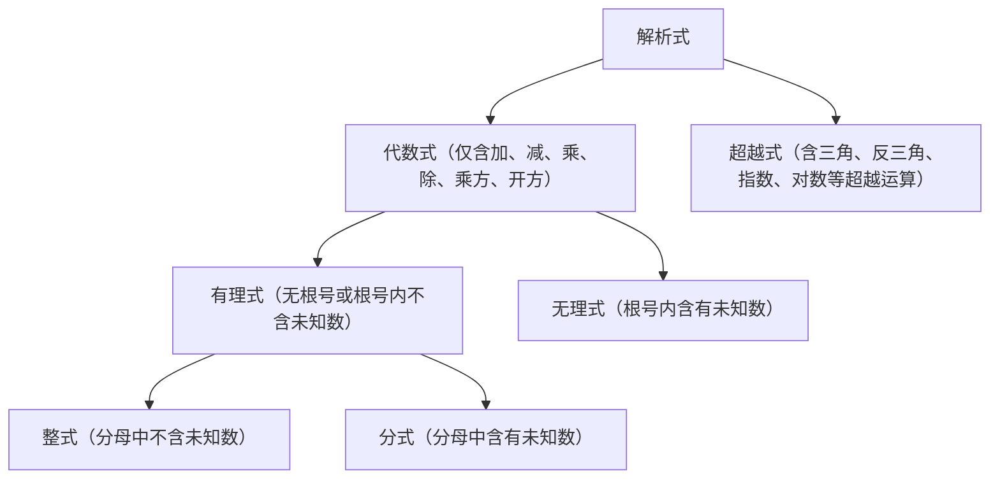
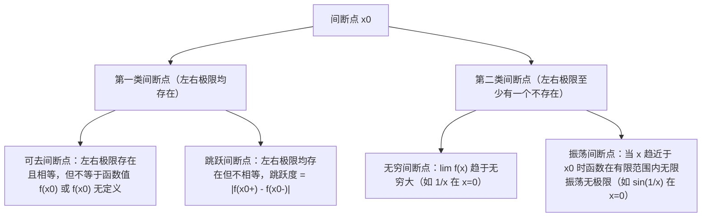

# 高等数学考研复习精细笔记 · 第一部分（预备知识与第1~10讲精要）

> **说明与说明规范**：
> 1. 本文档为手写考研复习笔记的全面电子化、结构化与严谨扩充版，深度融合张宇《基础30讲/零基础通关讲义》与《强化高数18讲》的教学逻辑体系。
> 2. 每个章节保留原始手写笔记标记（如 `<!-- [IMG_XXXX] -->`），便于追溯与核对。
> 3. 所有数学公式统一采用标准 LaTeX / KaTeX 语法，遵循考研数学大纲的高标准严谨性，并在概念定义、典型反例、核心考法、变形技巧及易错陷阱处进行深度标注。

---

## 预备知识：基础逻辑与初等代数、几何工具

<!-- [IMG_0582] -->
### 一、命题逻辑与逻辑推理套路

#### 1. 命题的基本概念与四种命题形式
* **命题定义**：能够判断真假的陈述句称为命题。判断为真的命题称为真命题，判断为假的命题称为假命题。
* **四种命题形式**：
  * **原命题**：若 $p$，则 $q$（记作 $p \implies q$）
  * **逆命题**：若 $q$，则 $p$（记作 $q \implies p$）
  * **否命题**：若 $\neg p$，则 $\neg q$（记作 $\neg p \implies \neg q$）
  * **逆否命题**：若 $\neg q$，则 $\neg p$（记作 $\neg q \implies \neg p$）
* **真假等价关系**：
  * 原命题与逆否命题**互为等价命题**（同真同假）：$(p \implies q) \iff (\neg q \implies \neg p)$。
  * 逆命题与否命题**互为等价命题**（同真同假）：$(q \implies p) \iff (\neg p \implies \neg q)$。
  * 原命题与逆命题、否命题之间**无必然真假因果关系**。

#### 2. 命题的否定与量词变换
* **全称量词与存在量词的否定**：
  * 全称命题否定：$\neg (\forall x \in M, P(x)) \iff \exists x \in M, \neg P(x)$
  * 特称命题否定：$\neg (\exists x \in M, P(x)) \iff \forall x \in M, \neg P(x)$
* **复合命题的否定（德·摩根定律）**：
  * “且”（合取）的否定：$\neg (p \land q) \iff (\neg p) \lor (\neg q)$（“都是”的否定是“不都是/至少有一个不是”）
  * “或”（析取）的否定：$\neg (p \lor q) \iff (\neg p) \land (\neg q)$（“至少有一个”的否定是“都不是”）

#### 3. 充分条件与必要条件术语辨析
| 逻辑推导关系 | 称谓表达 | 常见考题表述习惯 |
| :--- | :--- | :--- |
| $p \implies q$ | $p$ 是 $q$ 的**充分条件**；$q$ 是 $p$ 的**必要条件** | “要使 $q$ 成立，只需 $p$”；“$p$ 保证 $q$” |
| $q \implies p$ | $p$ 是 $q$ 的**必要条件**；$q$ 是 $p$ 的**充分条件** | “只有 $p$ 成立，$q$ 才能成立”；“$q$ 的必要条件是 $p$” |
| $p \iff q$ | $p$ 是 $q$ 的**充要条件**（充分必要条件） | “$p$ 当且仅当 $q$”；“$p$ 等价于 $q$” |
| $p \centernot\implies q$ 且 $q \centernot\implies p$ | $p$ 是 $q$ 的**既不充分也不必要条件** | 两者互不包含，互无蕴含关系 |

#### 4. 高等数学中六大常用逻辑推理套路
1. **直接推导法**：从已知条件 $P$ 出发，依次运用定义、公理、已证定理进行逻辑推演，直至得出目标结论 $Q$。
2. **逆否证法**：当直接证明 $P \implies Q$ 正面突破受阻、反面情况较为纯粹时，通过证明其等价逆否命题 $\neg Q \implies \neg P$ 达到目的。
3. **反证法**：
   * 假设结论不成立（即 $\neg Q$ 为真）。
   * 由已知 $P$ 与假设 $\neg Q$ 共同出发推导，导出与已知公理、定义、定理或已知条件相违背的逻辑矛盾（$R \land \neg R$）。
   * 从而推翻假设，断定 $Q$ 必然成立。
   * *注*：特别适用于否定性命题（如“证明无理数”、“证明不可导”、“证明方程无实根”）以及唯一性证明。
4. **数学归纳法**：
   * **第一数学归纳法**：1) 归纳奠基：验证 $n=1$ 时命题成立；2) 归纳假设与递推：假设 $n=k$ 时命题成立，推导出 $n=k+1$ 时命题亦成立；则命题对所有正整数 $n \in \mathbb{N}^+$ 成立。
   * **第二数学归纳法**：假设对于所有 $m \le k$ 命题均成立，推导 $n=k+1$ 成立。
5. **同一法**：欲证某几何图形或代数对象具有某性质，先构造一个具备该性质的唯一对象，再证明待证对象与该构造对象完全重合。
6. **构造法**：针对待证命题，巧妙构造辅助函数、辅助数列、反例模型或几何图形（中值定理中构造辅助函数是该思想的集中体现）。

---

<!-- [IMG_0583] -->
### 二、代数式分类、韦达定理与均值不等式链

#### 1. 解析式与代数式的分类体系

#### 2. 一元二次方程与韦达定理
* **标准方程**：$ax^2 + bx + c = 0 \quad (a \ne 0)$
* **根的判别式**：$\Delta = b^2 - 4ac$
  * $\Delta > 0 \iff$ 方程有两个不相等的实数根 $x_1 \ne x_2$；
  * $\Delta = 0 \iff$ 方程有两个相等的实数根 $x_1 = x_2 = -\frac{b}{2a}$；
  * $\Delta < 0 \iff$ 方程有一对共轭复数根 $x_{1,2} = \frac{-b \pm i\sqrt{4ac - b^2}}{2a}$。
* **韦达定理（Vieta's Formulas）**：
  $$x_1 + x_2 = -\frac{b}{a}, \quad x_1 x_2 = \frac{c}{a}$$
* **因式分解公式**：
  $$ax^2 + bx + c = a(x - x_1)(x - x_2)$$
* **常用对称代数变形**：
  * $x_1^2 + x_2^2 = (x_1 + x_2)^2 - 2x_1 x_2 = \frac{b^2 - 2ac}{a^2}$
  * $|x_1 - x_2| = \sqrt{(x_1 + x_2)^2 - 4x_1 x_2} = \frac{\sqrt{\Delta}}{|a|}$
  * $\frac{1}{x_1} + \frac{1}{x_2} = \frac{x_1 + x_2}{x_1 x_2} = -\frac{b}{c}$

#### 3. 不等式的基本运算法则
1. **加法单调性**：$a > b \implies a + c > b + c$；$a > b, c > d \implies a + c > b + d$。
2. **乘法符号律**：
   * $a > b, c > 0 \implies ac > bc$；
   * $a > b, c < 0 \implies ac < bc$（方向颠倒）；
   * $a > b > 0, c > d > 0 \implies ac > bd$。
3. **倒数法则**：
   * 若 $a > b > 0$，则 $\frac{1}{a} < \frac{1}{b}$；
   * 若 $a < b < 0$，则 $\frac{1}{a} < \frac{1}{b}$；
   * 若 $a > 0 > b$，则 $\frac{1}{a} > 0 > \frac{1}{b}$。
4. **乘方与开方法则**：
   * 若 $a > b > 0$，则对任意正整数 $n$，有 $a^n > b^n$ 及 $\sqrt[n]{a} > \sqrt[n]{b}$。

#### 4. 经典四大均值不等式链
设正实数 $a, b > 0$，定义四大经典平均数：
* **调和平均数（Harmonic Mean）**：$H_2 = \frac{2}{\frac{1}{a} + \frac{1}{b}} = \frac{2ab}{a+b}$
* **几何平均数（Geometric Mean）**：$G_2 = \sqrt{ab}$
* **算术平均数（Arithmetic Mean）**：$A_2 = \frac{a+b}{2}$
* **平方平均数 / 均方根（Quadratic Mean / RMS）**：$Q_2 = \sqrt{\frac{a^2+b^2}{2}}$

**全链不等式**：
$$\frac{2}{\frac{1}{a} + \frac{1}{b}} \le \sqrt{ab} \le \frac{a+b}{2} \le \sqrt{\frac{a^2+b^2}{2}}$$
即：
$$H_2 \le G_2 \le A_2 \le Q_2$$
* **取等条件**：当且仅当 $a = b$ 时，所有等号同时成立。

**$n$ 元实数推广**（设 $a_1, a_2, \dots, a_n > 0$）：
$$\frac{n}{\sum_{i=1}^n \frac{1}{a_i}} \le \left(\prod_{i=1}^n a_i\right)^{\frac{1}{n}} \le \frac{1}{n}\sum_{i=1}^n a_i \le \sqrt{\frac{1}{n}\sum_{i=1}^n a_i^2}$$
取等条件依然为 $a_1 = a_2 = \dots = a_n$。

---

<!-- [IMG_0584] -->
### 三、重要不等式：绝对值三角不等式与柯西-施瓦茨不等式

#### 1. 绝对值三角不等式
对任意实数（或复数）$a, b$：
$$||a| - |b|| \le |a \pm b| \le |a| + |b|$$

* **右侧取等条件（$|a+b| = |a| + |b|$ 或 $|a-b| = |a| + |b|$）**：
  * $|a + b| = |a| + |b| \iff ab \ge 0$（即 $a, b$ 同号或至少有一个为 0）
  * $|a - b| = |a| + |b| \iff ab \le 0$（即 $a, b$ 异号或至少有一个为 0）
* **左侧取等条件（$|a-b| = ||a| - |b||$ 或 $|a+b| = ||a| - |b||$）**：
  * $|a - b| = ||a| - |b|| \iff ab \ge 0$
  * $|a + b| = ||a| - |b|| \iff ab \le 0$
* **$n$ 元推广形式**：
  $$\left|\sum_{i=1}^n a_i\right| \le \sum_{i=1}^n |a_i|$$
  等号成立当且仅当所有非零实数 $a_i$ 同号。

#### 2. 柯西-施瓦茨不等式（Cauchy-Schwarz Inequality）
高等数学及线性代数中出现频率最高的不等式之一。

##### (1) 代数形式
对任意实数 $a_1, a_2, \dots, a_n$ 及 $b_1, b_2, \dots, b_n$：
$$\left(\sum_{i=1}^n a_i b_i\right)^2 \le \left(\sum_{i=1}^n a_i^2\right)\left(\sum_{i=1}^n b_i^2\right)$$
* **展开二维特例**：
  $$(a_1 b_1 + a_2 b_2)^2 \le (a_1^2 + a_2^2)(b_1^2 + b_2^2)$$
  *恒等式推导（拉格朗日恒等式）*：
  $$(a_1^2 + a_2^2)(b_1^2 + b_2^2) - (a_1 b_1 + a_2 b_2)^2 = (a_1 b_2 - a_2 b_1)^2 \ge 0$$
* **取等条件**：当且仅当两数组对应分量成比例，即存在不全为 0 的实数 $k_1, k_2$ 使得 $k_1 a_i + k_2 b_i = 0$（即向量 $(a_1, \dots, a_n)$ 与 $(b_1, \dots, b_n)$ 线性相关）。

##### (2) 向量数量积形式
设 $\vec{\alpha}, \vec{\beta} \in \mathbb{R}^n$：
$$|\vec{\alpha} \cdot \vec{\beta}| \le \|\vec{\alpha}\| \|\vec{\beta}\|$$
* **几何直观**：$|\vec{\alpha} \cdot \vec{\beta}| = \|\vec{\alpha}\| \|\vec{\beta}\| |\cos\langle\vec{\alpha}, \vec{\beta}\rangle| \le \|\vec{\alpha}\| \|\vec{\beta}\|$。等号成立当且仅当两向量共线（平行）。

##### (3) 连续函数定积分形式（考研压轴高频）
设函数 $f(x), g(x)$ 在区间 $[a, b]$ 上连续（或平方可积）：
$$\left(\int_a^b f(x)g(x) \, dx\right)^2 \le \left(\int_a^b f^2(x) \, dx\right)\left(\int_a^b g^2(x) \, dx\right)$$
* **构造二次型证明法**：
  对任意实数 $t \in \mathbb{R}$，考察非负二次积分：
  $$I(t) = \int_a^b [t f(x) + g(x)]^2 \, dx = t^2 \int_a^b f^2(x)dx + 2t \int_a^b f(x)g(x)dx + \int_a^b g^2(x)dx \ge 0$$
  该一元二次多项式恒非负，故其判别式必须满足 $\Delta \le 0$：
  $$\Delta = 4\left(\int_a^b f(x)g(x)dx\right)^2 - 4\left(\int_a^b f^2(x)dx\right)\left(\int_a^b g^2(x)dx\right) \le 0$$
  移项即得柯西-施瓦茨积分不等式！
* **取等条件**：在 $[a, b]$ 上存在不全为零的常数 $k_1, k_2$ 使得 $k_1 f(x) + k_2 g(x) \equiv 0$（连续函数情形下即两函数成比例：$f(x) = c g(x)$）。

---

<!-- [IMG_0585] -->
### 四、基本初等函数图象与数列基础

#### 1. 幂、指、对函数特征对比
* **幂函数 $y = x^\alpha$**：
  * 图象必过点 $(1, 1)$。
  * $\alpha > 0$ 时，在 $[0, +\infty)$ 单调递增，过原点 $(0, 0)$；$\alpha > 1$ 下凸， $0 < \alpha < 1$ 上凸。
  * $\alpha < 0$ 时，在 $(0, +\infty)$ 单调递减，图象不过原点，以两坐标轴为渐近线。
* **指数函数 $y = a^x \quad (a > 0, a \ne 1)$**：
  * 图象必过点 $(0, 1)$，值域为 $(0, +\infty)$。
  * 当 $a > 1$ 时，严格单调递增，增长速率极快；
  * 当 $0 < a < 1$ 时，严格单调递减；
  * $x$ 轴（$y=0$）为水平渐近线。
* **对数函数 $y = \log_a x \quad (a > 0, a \ne 1, x > 0)$**：
  * 图象必过点 $(1, 0)$，定义域为 $(0, +\infty)$，值域为 $\mathbb{R}$。
  * 当 $a > 1$ 时，严格单调递增，但增长速率极为缓慢（$\lim_{x\to +\infty}\frac{\log_a x}{x^\alpha} = 0, \alpha > 0$）；
  * 当 $0 < a < 1$ 时，严格单调递减；
  * $y$ 轴（$x=0$）为铅直渐近线。

#### 2. 等差数列与等比数列全套公式
| 数列类型 | 等差数列 $\{a_n\}$ | 等比数列 $\{a_n\}$ ($q \ne 0$) |
| :--- | :--- | :--- |
| **定义** | $a_{n+1} - a_n = d$ (常数) | $\frac{a_{n+1}}{a_n} = q$ (常数) |
| **通项公式** | $a_n = a_1 + (n-1)d$ | $a_n = a_1 q^{n-1}$ |
| **前 $n$ 项和 $S_n$** | $S_n = \frac{n(a_1 + a_n)}{2} = na_1 + \frac{n(n-1)}{2}d$ | $S_n = \begin{cases} na_1, & q=1 \\ \frac{a_1(1-q^n)}{1-q} = \frac{a_1 - a_n q}{1-q}, & q \ne 1 \end{cases}$ |
| **无穷级数和** | 发散（当 $d \ne 0$ 或 $a_1 \ne 0$） | 当 $|q| < 1$ 时收敛：$S = \sum_{n=1}^\infty a_1 q^{n-1} = \frac{a_1}{1-q}$ |
| **关键下标性质** | 若 $m + n = p + q$，则 $a_m + a_n = a_p + a_q$ | 若 $m + n = p + q$，则 $a_m a_n = a_p a_q$ |

#### 3. 单调数列与极限判定基础
* **单调增数列**：$\forall n \in \mathbb{N}^+, a_{n+1} \ge a_n$（若严格大于则为严格递增）。
* **单调减数列**：$\forall n \in \mathbb{N}^+, a_{n+1} \le a_n$。
* **单调有界收敛准则（高数核心定理）**：
  * 单调递增且有上界 $\implies$ 必有极限；
  * 单调递减且有下界 $\implies$ 必有极限。

---

<!-- [IMG_0586] -->
### 五、极坐标系基础理论与典型曲线方程

#### 1. 极坐标系的建立与坐标表示
* **极坐标系定义**：
  * 在平面内选定一点 $O$ 称为**极点**；
  * 自极点 $O$ 引一条射线 $Ox$ 称为**极轴**；
  * 规定极轴正方向逆时针旋转所成角为正。
  * 平面上任意点 $M$ 的位置由极径 $r$（$|OM|$）和极角 $\theta$（$Ox$ 到 $OM$ 的夹角）决定，记为 $(r, \theta)$。通常约定 $r \ge 0, \theta \in [0, 2\pi)$ 或 $(-\pi, \pi]$。
* **极坐标与直角坐标的互化公式**（以极点为原点，极轴为 $x$ 轴正半轴）：
  $$\begin{cases} x = r \cos\theta \\ y = r \sin\theta \end{cases} \iff \begin{cases} r^2 = x^2 + y^2 \\ \tan\theta = \frac{y}{x} \quad (x \ne 0) \end{cases}$$

#### 2. 直线的极坐标方程
* **过极点且倾角为 $\alpha$ 的直线**：
  $$\theta = \alpha \quad \text{或} \quad \theta = \alpha + \pi$$
* **过点 $(a, 0)$ 且垂直于极轴的直线**：
  $$r \cos\theta = a \iff x = a$$
* **过点 $(b, \frac{\pi}{2})$ 且平行于极轴的直线**：
  $$r \sin\theta = b \iff y = b$$
* **一般直线**（极点到直线的垂线段长为 $p$，垂线段倾角为 $\alpha$）：
  $$r \cos(\theta - \alpha) = p$$

#### 3. 圆的极坐标方程
* **圆心在极点，半径为 $R$ 的圆**：
  $$r = R$$
* **圆心在极轴上 $(a, 0)$，半径为 $a$（经过极点）的圆**：
  直角坐标：$(x-a)^2 + y^2 = a^2 \iff x^2 + y^2 = 2ax$
  极坐标化简得：
  $$r = 2a \cos\theta \quad \left(-\frac{\pi}{2} \le \theta \le \frac{\pi}{2}\right)$$
* **圆心在 $(a, \frac{\pi}{2})$，半径为 $a$（经过极点）的圆**：
  直角坐标：$x^2 + (y-a)^2 = a^2 \iff x^2 + y^2 = 2ay$
  极坐标化简得：
  $$r = 2a \sin\theta \quad (0 \le \theta \le \pi)$$
* **一般圆**（圆心在 $(r_0, \theta_0)$，半径为 $R$）：
  由平面余弦定理，曲线上动点 $(r, \theta)$ 满足：
  $$r^2 - 2 r r_0 \cos(\theta - \theta_0) + r_0^2 = R^2$$

#### 4. 考研高频典型曲线初识
1. **阿基米德螺线**：$r = a\theta \quad (a > 0)$
2. **心形线（Cardioid）**：
   * $r = a(1 - \cos\theta)$（对称轴为极轴，凹入点在原点，凹向右方）
   * $r = a(1 + \cos\theta)$（对称轴为极轴，凹向左方）
   * $r = a(1 \pm \sin\theta)$（对称轴为 $y$ 轴）
3. **伯努利双纽线（Lemniscate）**：
   $$r^2 = a^2 \cos 2\theta \quad \left(-\frac{\pi}{4} \le \theta \le \frac{\pi}{4}, \, \frac{3\pi}{4} \le \theta \le \frac{5\pi}{4}\right)$$
4. **三叶玫瑰线与四叶玫瑰线**：
   * $r = a \sin 3\theta$ 或 $r = a \cos 3\theta$（3片花瓣）
   * $r = a \sin 2\theta$ 或 $r = a \cos 2\theta$（4片花瓣）

---

## 第01讲：函数、极限与连续性

<!-- [IMG_0587] -->
### 一、函数概念、四大特性与极限基础性质

#### 1. 函数的基本概念
* **定义**：设数集 $D \subset \mathbb{R}$，若对 $\forall x \in D$，按照对应法则 $f$，都有唯一确定的实数 $y$ 与之对应，则称 $y$ 为 $x$ 的函数，记作 $y = f(x)$。
  * $x$ 称为自变量，$D = D_f$ 称为**定义域**。
  * 集合 $R_f = \{y \mid y = f(x), x \in D\}$ 称为**值域**。
  * 函数的两大构成要素：**定义域**与**对应法则**（两者均相同才为同一函数）。
* **反函数**：
  * **存在充要条件**：映射为双射（单调函数必有反函数，严格增对应严格增，严格减对应严格减）。
  * **图象对称性**：$y = f(x)$ 与其反函数 $y = f^{-1}(x)$ 的图象关于直线 $y = x$ 轴对称。
  * **导数互逆关系**：若 $y=f(x)$ 可导且 $f'(x) \ne 0$，则 $[f^{-1}(y)]' = \frac{1}{f'(x)}$ 或 $\frac{dx}{dy} = \frac{1}{\frac{dy}{dx}}$。
* **双曲函数与反双曲函数核心族**：
  * **双曲正弦**：$\sinh x = \frac{e^x - e^{-x}}{2}$（奇函数，$\mathbb{R}$ 上严格单调递增，$(\sinh x)' = \cosh x$）
  * **双曲余弦**：$\cosh x = \frac{e^x + e^{-x}}{2}$（偶函数，悬链线，值域 $[1, +\infty)$，$(\cosh x)' = \sinh x$）
  * **双曲正切**：$\tanh x = \frac{\sinh x}{\cosh x} = \frac{e^x - e^{-x}}{e^x + e^{-x}}$（奇函数，值域 $(-1, 1)$，$(\tanh x)' = \frac{1}{\cosh^2 x} = 1 - \tanh^2 x$）
  * **核心恒等式**：$\cosh^2 x - \sinh^2 x = 1$，$1 - \tanh^2 x = \operatorname{sech}^2 x$
  * **反双曲函数对数表达**：
    * $\operatorname{arsh} x = \ln(x + \sqrt{x^2 + 1}) \quad (x \in \mathbb{R})$
    * $\operatorname{arch} x = \ln(x + \sqrt{x^2 - 1}) \quad (x \ge 1)$
    * $\operatorname{arth} x = \frac{1}{2}\ln\frac{1+x}{1-x} \quad (|x| < 1)$

#### 2. 函数的四大基本特性
1. **有界性**：
   * 设 $f(x)$ 在集合 $X$ 上有定义。若 $\exists M > 0$，使得对 $\forall x \in X$，均有 $|f(x)| \le M$，则称 $f(x)$ 在 $X$ 上有界。
   * 等价于：既有上界又有下界（$\inf_{x\in X} f(x) > -\infty$ 且 $\sup_{x\in X} f(x) < +\infty$）。
2. **单调性**：
   * 设区间 $I \subset D_f$。若对 $\forall x_1, x_2 \in I$ 且 $x_1 < x_2$，恒有 $f(x_1) < f(x_2)$，则称 $f(x)$ 在 $I$ 上严格单调递增；若 $f(x_1) > f(x_2)$，则严格单调递减。
3. **奇偶性**：
   * 定义域必须关于原点对称（这是具有奇偶性的先决条件）。
   * **奇函数**：$f(-x) = -f(x)$ $\implies$ 图象关于原点对称；若 $0 \in D_f$，则必有 $f(0) = 0$。
   * **偶函数**：$f(-x) = f(x)$ $\implies$ 图象关于 $y$ 轴对称；若可导，则必有 $f'(0) = 0$。
   * **导数与积分的奇偶互转定理**：
     * 可导奇函数的导函数为偶函数；可导偶函数的导函数为奇函数。
     * 连续奇函数的全体原函数全为偶函数（即 $\int_a^x f(t)dt$ 为偶函数，对任意常数 $a$）。
     * 连续偶函数的全体原函数中，**有且仅有一个是奇函数**（即变下限为 0 的变限积分 $F(x) = \int_0^x f(t)dt$ 是奇函数，其余原函数 $F(x)+C$ 当 $C \ne 0$ 时既非奇亦非偶）。
4. **周期性**：
   * 若存在正数 $T > 0$，使得对 $\forall x \in D_f$，恒有 $x \pm T \in D_f$ 且 $f(x+T) = f(x)$，则称 $f(x)$ 为以 $T$ 为周期的周期函数。
   * 可导周期函数的导函数仍是同周期函数。
   * **变限积分周期性条件**：连续周期函数 $f(x)$（周期为 $T$）的变限积分 $F(x) = \int_0^x f(t)dt$ 具有周期性（周期为 $T$）的**充要条件**是：其在一个周期上的定积分积分为零，即 $\int_0^T f(t)dt = 0$。

#### 3. 极限的严格定义
* **$\varepsilon-\delta$ 语言（$x \to x_0$）**：
  $$\lim_{x\to x_0} f(x) = A \iff \forall \varepsilon > 0, \exists \delta > 0, \text{当 } 0 < |x - x_0| < \delta \text{ 时，恒有 } |f(x) - A| < \varepsilon$$
* **单侧极限与充要定理**：
  * 左极限：$\lim_{x\to x_0^-} f(x) = f(x_0^-)$
  * 右极限：$\lim_{x\to x_0^+} f(x) = f(x_0^+)$
  * **极限存在充要条件**：
    $$\lim_{x\to x_0} f(x) = A \iff f(x_0^-) = f(x_0^+) = A$$
  * *必分左右极限求的三大经典结构*：
    1. 分段函数在分段点处；
    2. 含 $e^{\frac{1}{x-x_0}}$ 结构当 $x \to x_0$ 时（$x \to 0^+$ 为 $+\infty$，$x \to 0^-$ 为 $0$）；
    3. 含 $\arctan\frac{1}{x-x_0}$ 或 $\operatorname{arccot}\frac{1}{x-x_0}$ 结构当 $x \to x_0$ 时（趋于 $\pm \frac{\pi}{2}$ 或 $0/\pi$）。

#### 4. 极限的三大基本性质
1. **唯一性**：若极限 $\lim_{x\to x_0} f(x)$ 存在，则该极限值必定唯一。
2. **局部有界性**：若 $\lim_{x\to x_0} f(x) = A$，则存在 $\delta > 0$ 及常数 $M > 0$，使得对 $\forall x \in \mathring{U}(x_0, \delta)$，恒有 $|f(x)| \le M$。
3. **局部保号性（极为重要）**：
   * **脱帽法（强不等式推强不等式）**：若 $\lim_{x\to x_0} f(x) = A > 0$（或 $A < 0$），则 $\exists \delta > 0$，当 $x \in \mathring{U}(x_0, \delta)$ 时，恒有 $f(x) > 0$（或 $f(x) < 0$）。
     更精确地：对 $\forall r \in (0, A)$，$\exists \delta > 0$，使得 $f(x) > r > 0$。
   * **戴帽法（弱不等式极限仍为弱不等式）**：若在去心邻域 $\mathring{U}(x_0, \delta)$ 内恒有 $f(x) \ge 0$（或 $f(x) \le 0$），且 $\lim_{x\to x_0} f(x) = A$ 存在，则必有 $A \ge 0$（或 $A \le 0$）。
   * *避坑警示*：严格不等式在取极限后**等号可能被激活**！例如：$x > 0$ 时 $\frac{1}{x+1} > 0$，但 $\lim_{x\to +\infty}\frac{1}{x+1} = 0$。

#### 5. 无穷小量与无穷大量
* **无穷小量**：以 0 为极限的变量（$\lim f(x) = 0$）。0 是唯一可以作为无穷小量的常数。
* **无穷大量**：极限为无穷大的变量（$\lim |f(x)| = +\infty$）。注意：无穷大不是数，而是一种变化状态。
* **互为倒数关系**：在同一变化过程中，若 $f(x)$ 为无穷大，则 $\frac{1}{f(x)}$ 为无穷小；反之，若 $f(x)$ 为无穷小且 $f(x) \ne 0$，则 $\frac{1}{f(x)}$ 为无穷大。
* **基本性质**：
  * 有限个无穷小量的代数和仍为无穷小量；
  * 有界函数与无穷小量的乘积仍是无穷小量（**极其常用的放缩杀手锏**，如 $\lim_{x\to 0} x \sin\frac{1}{x} = 0$）。

---

<!-- [IMG_0588] -->
### 二、无穷小阶数比较、常用等价代换、未定式与间断点分类

#### 1. 无穷小阶数比较
设在同一极限过程中，$\alpha(x) \to 0, \beta(x) \to 0$，且 $\alpha(x) \ne 0$：
* **高阶无穷小**：若 $\lim \frac{\beta}{\alpha} = 0$，记作 $\beta = o(\alpha)$。
* **低阶无穷小**：若 $\lim \frac{\beta}{\alpha} = \infty$。
* **同阶无穷小**：若 $\lim \frac{\beta}{\alpha} = c \ne 0$。
* **等价无穷小**：若 $\lim \frac{\beta}{\alpha} = 1$，记作 $\alpha \sim \beta$。
* **$k$ 阶无穷小**：若 $\lim \frac{\beta}{\alpha^k} = c \ne 0$ ($k > 0$)，则称 $\beta$ 是关于 $\alpha$ 的 $k$ 阶无穷小。

#### 2. 常用等价无穷小代换公式大全（当 $x \to 0$ 时）
##### (1) 一阶基础等价
$$\sin x \sim x, \quad \tan x \sim x, \quad \arcsin x \sim x, \quad \arctan x \sim x$$
$$e^x - 1 \sim x, \quad \ln(1+x) \sim x, \quad (1+x)^\alpha - 1 \sim \alpha x$$
$$a^x - 1 \sim x \ln a, \quad \log_a(1+x) \sim \frac{x}{\ln a}$$

##### (2) 二阶基础等价
$$1 - \cos x \sim \frac{1}{2} x^2, \quad \cosh x - 1 \sim \frac{1}{2} x^2, \quad x - \ln(1+x) \sim \frac{1}{2} x^2$$

##### (3) 高阶差量等价（极其容易直接命题考查！）
* $\tan x - \sin x \sim \frac{1}{2} x^3$
* $x - \sin x \sim \frac{1}{6} x^3$
* $\arcsin x - x \sim \frac{1}{6} x^3$
* $\tan x - x \sim \frac{1}{3} x^3$
* $x - \arctan x \sim \frac{1}{3} x^3$
* $\arcsin x - \sin x = (\arcsin x - x) + (x - \sin x) \sim \frac{1}{6}x^3 + \frac{1}{6}x^3 = \frac{1}{3} x^3$
* $\tan x - \arcsin x \sim \frac{1}{6} x^3$

#### 3. 经典函数的增长阶梯比较（$x \to +\infty$）
$$\ln^\alpha x \ll x^\beta \ll a^x \ll x! \ll x^x \quad (\alpha > 0, \beta > 0, a > 1)$$
* **考研解题口诀**：“对数不如幂，幂不如指数，指数不如阶乘，阶乘不如幂指”。在抓大头（求 $\frac{\infty}{\infty}$ 极限）时，低阶项可直接忽略。

#### 4. 七大未定式分类及标准转化路径
| 未定式类型 | 核心处理技巧与转化方法 |
| :--- | :--- |
| $\frac{0}{0}$ | 洛必达法则、泰勒展开公式（展开至首个非零系数项）、等价无穷小代换、提公因式消零 |
| $\frac{\infty}{\infty}$ | 洛必达法则、分子分母同除以最高阶增长项（抓大头）、斯托尔兹定理（针对数列） |
| $0 \cdot \infty$ | 化商法：$u \cdot v = \frac{u}{1/v} \implies \frac{0}{0}$ 或 $\frac{v}{1/u} \implies \frac{\infty}{\infty}$（化简原则：对数、反三角优先留在分子） |
| $\infty - \infty$ | 1) 分式结构：**通分**化为 $\frac{0}{0}$；2) 根式无理结构：**有理化**；3) 变量提项：**提最高阶无穷大因子**化为 $0 \cdot \infty$ |
| $1^\infty$ | **核心基准公式法**：若 $\alpha(x) \to 0, \beta(x) \to \infty$，则 $\lim [1+\alpha(x)]^{\beta(x)} = e^{\lim \alpha(x)\beta(x)}$；或写为指数形式 $e^{\lim \beta(x)\ln(1+\alpha(x))}$ |
| $0^0$ | 对数恒等式转化：$u(x)^{v(x)} = e^{v(x) \ln u(x)}$，转化为求指数极限 $\lim v(x) \ln u(x) \, (0 \cdot (-\infty))$ |
| $\infty^0$ | 对数恒等式转化：$u(x)^{v(x)} = e^{v(x) \ln u(x)}$，转化为求指数极限 $\lim v(x) \ln u(x) \, (0 \cdot \infty)$ |

#### 5. 函数的连续性与间断点分类体系
* **连续定义**：若 $\lim_{x\to x_0} f(x) = f(x_0)$，即 $\lim_{\Delta x \to 0} \Delta y = 0$，则称 $f(x)$ 在点 $x_0$ 处连续。
  * 连续需满足三要素：1) $f(x)$ 在 $x_0$ 有定义；2) $\lim_{x\to x_0} f(x)$ 存在；3) 极限值等于函数值。
* **间断点分类（看左右极限是否存在有限值）**：

---

<!-- [IMG_0589] -->
### 三、补充专题1：初等函数深入、有界性判别与三角函数图象

#### 1. 双曲与反双曲函数全面对照
* **$\sinh x$ vs $\cosh x$**：
  * $\sinh 0 = 0, \cosh 0 = 1$。
  * 导数：$(\sinh x)' = \cosh x, (\cosh x)' = \sinh x$（无负号，注意与三角函数区分！）。
  * 积分：$\int \sinh x dx = \cosh x + C, \int \cosh x dx = \sinh x + C$。
* **反双曲函数推导解析**（以 $\operatorname{arsh} x$ 为例）：
  令 $y = \sinh x = \frac{e^x - e^{-x}}{2}$，两边同乘 $2e^x$ 得：$(e^x)^2 - 2y(e^x) - 1 = 0$。
  解此关于 $e^x$ 的一元二次方程（由于 $e^x > 0$，舍去负根）：
  $$e^x = y + \sqrt{y^2 + 1} \implies x = \ln(y + \sqrt{y^2 + 1})$$
  故 $\operatorname{arsh} x = \ln(x + \sqrt{x^2 + 1})$。同理可得 $\operatorname{arch} x = \ln(x + \sqrt{x^2 - 1}) \, (x \ge 1)$。

#### 2. 函数有界性严格判定准则与经典反例分析
* **闭区间有界性定理**：若函数 $f(x)$ 在闭区间 $[a, b]$ 上连续，则 $f(x)$ 在 $[a, b]$ 上必定有界。
* **开区间 $(a, b)$ 连续函数有界性充要条件**：
  若 $f(x)$ 在开区间 $(a, b)$ 上连续，则 $f(x)$ 在 $(a, b)$ 上有界的**充要条件**是：其在两端点的单侧极限 $\lim_{x\to a^+} f(x)$ 与 $\lim_{x\to b^-} f(x)$ **均存在且为有限值**。
  * *反例1*：$f(x) = \frac{1}{x}$ 在 $(0, 1)$ 上连续，但 $\lim_{x\to 0^+} \frac{1}{x} = +\infty$，故在 $(0, 1)$ 无界。
  * *反例2*：$f(x) = \sin\frac{1}{x}$ 在 $(0, 1)$ 上，虽然 $\lim_{x\to 0^+} \sin\frac{1}{x}$ 不存在（振荡），但由 $|\sin u| \le 1$ 可知其在 $(0, 1)$ 显然有界！说明端点极限存在是充分条件，若极限不存在但为振荡有界，函数仍可有界。
* **导数有界与原函数有界的关系辨析**：
  * **定理**：若导函数 $f'(x)$ 在区间 $I$ 上有界，即 $|f'(x)| \le M$，则由拉格朗日中值定理：
    $$|f(x_1) - f(x_2)| = |f'(\xi)| |x_1 - x_2| \le M |x_1 - x_2|$$
    故在**有限区间**上，$f(x)$ 必然有界（满足 Lipschitz 条件）。
  * **反之不成立（典型反例）**：$f(x)$ 有界，推不出 $f'(x)$ 有界！
    *反例*：$f(x) = \sin(x^2)$ 在 $\mathbb{R}$ 上显然有界（$|f(x)| \le 1$），但其导数 $f'(x) = 2x \cos(x^2)$，当 $x \to +\infty$ 时导数振荡无界！
    *有限区间反例*：$f(x) = \sqrt{x}$ 在 $(0, 1)$ 上有界（值域 $(0, 1)$），但 $f'(x) = \frac{1}{2\sqrt{x}} \to +\infty$（$x \to 0^+$），导函数无界。

#### 3. 三角函数 $\sin, \cos, \tan, \cot$ 图像与核心性质
* $\sin x, \cos x$：定义域 $\mathbb{R}$，值域 $[-1, 1]$，最小正周期 $2\pi$。
* $\tan x$：定义域 $x \ne k\pi + \frac{\pi}{2}$，值域 $\mathbb{R}$，最小正周期 $\pi$，在每个开区间 $(k\pi-\frac{\pi}{2}, k\pi+\frac{\pi}{2})$ 严格单增，铅直渐近线为 $x = k\pi + \frac{\pi}{2}$。
* $\cot x = \frac{1}{\tan x}$：定义域 $x \ne k\pi$，值域 $\mathbb{R}$，最小正周期 $\pi$，在开区间 $(k\pi, (k+1)\pi)$ 严格单减，铅直渐近线为 $x = k\pi$。

---

<!-- [IMG_0590] -->
### 四、补充专题2：正割、余割与反三角函数体系

#### 1. 正割函数 $\sec x$ 与余割函数 $\csc x$
* **定义**：
  $$\sec x = \frac{1}{\cos x}, \quad \csc x = \frac{1}{\sin x}$$
* **定义域与值域**：
  * $\sec x$：定义域 $x \ne k\pi + \frac{\pi}{2}$，值域 $(-\infty, -1] \cup [1, +\infty)$，偶函数，周期 $2\pi$。
  * $\csc x$：定义域 $x \ne k\pi$，值域 $(-\infty, -1] \cup [1, +\infty)$，奇函数，周期 $2\pi$。
* **基本导数与积分**：
  * $(\sec x)' = \sec x \tan x, \quad (\csc x)' = -\csc x \cot x$
  * $\int \sec x dx = \ln|\sec x + \tan x| + C = \ln|\tan(\frac{x}{2} + \frac{\pi}{4})| + C$
  * $\int \csc x dx = \ln|\csc x - \cot x| + C = \ln|\tan\frac{x}{2}| + C$
* **基本平方恒等式族**：
  $$1 + \tan^2 x = \sec^2 x, \quad 1 + \cot^2 x = \csc^2 x$$

#### 2. 六大反三角函数主值区间与互补恒等式
| 函数 | 符号 | 定义域 | 主值区间（值域） | 单调性 | 奇偶性 |
| :--- | :--- | :--- | :--- | :--- | :--- |
| 反正弦 | $\arcsin x$ | $[-1, 1]$ | $[-\frac{\pi}{2}, \frac{\pi}{2}]$ | 严格单调递增 | 奇函数：$\arcsin(-x) = -\arcsin x$ |
| 反余弦 | $\arccos x$ | $[-1, 1]$ | $[0, \pi]$ | 严格单调递减 | 非奇非偶：$\arccos(-x) = \pi - \arccos x$ |
| 反正切 | $\arctan x$ | $\mathbb{R}$ | $(-\frac{\pi}{2}, \frac{\pi}{2})$ | 严格单调递增 | 奇函数：$\arctan(-x) = -\arctan x$ |
| 反余切 | $\operatorname{arccot} x$ | $\mathbb{R}$ | $(0, \pi)$ | 严格单调递减 | 非奇非偶：$\operatorname{arccot}(-x) = \pi - \operatorname{arccot} x$ |

* **互补恒等式（极其重要）**：
  $$\arcsin x + \arccos x = \frac{\pi}{2} \quad (x \in [-1, 1])$$
  $$\arctan x + \operatorname{arccot} x = \frac{\pi}{2} \quad (x \in \mathbb{R})$$
* **倒数关系恒等式**：
  $$\arctan x + \arctan\frac{1}{x} = \begin{cases} \frac{\pi}{2}, & x > 0 \\ -\frac{\pi}{2}, & x < 0 \end{cases}$$

---

<!-- [IMG_0591] -->
### 五、补充专题3：极限运算法则要害、渐近线系统与重要工具

#### 1. 极限四则运算法则的前提条件与拆分合法性
* **基本法则**：若 $\lim f(x) = A, \lim g(x) = B$ 均**独立存在且为有限实数**，则：
  $$\lim [f(x) \pm g(x)] = A \pm B, \quad \lim [f(x) \cdot g(x)] = A \cdot B, \quad \lim \frac{f(x)}{g(x)} = \frac{A}{B} \, (B \ne 0)$$
* **拆分合法性的考研红线**：
  1. **必须保证拆分后的每一个子极限各自独立存在**。若随意拆开出现 $\infty - \infty$ 或 $0 \cdot \infty$，属于严重逻辑错误！
  2. **非零因子先求出**：若乘积项中某一因式的极限存在且**不为 0**，可以将其极限值先求出来提至极限符号外，即：
     $$\lim [f(x) \cdot g(x)] = \lim f(x) \cdot \lim g(x) = A \cdot \lim g(x) \quad (\text{只要 } A \ne 0 \text{ 且有限})$$
  3. **加减法中的等价代换前提**：在做加减法时，若 $\alpha \sim \alpha', \beta \sim \beta'$，原则上不能直接替换；但若 $\lim \frac{\alpha}{\beta} \ne 1$（即两者相减不抵消主部），可采用泰勒展开展开至同阶差量！

#### 2. 两个重要极限公式及其推广
1. **第一重要极限**：
   $$\lim_{x\to 0} \frac{\sin x}{x} = 1 \iff \sin \square \sim \square \quad (\square \to 0)$$
2. **第二重要极限**：
   $$\lim_{x\to \infty} \left(1 + \frac{1}{x}\right)^x = e \quad \text{或} \quad \lim_{x\to 0} (1 + x)^{\frac{1}{x}} = e$$
   推广形态：$(1 + \square)^{\frac{1}{\square}} \to e \quad (\square \to 0)$。

#### 3. 曲线渐近线的完整判定法则
* **水平渐近线**：
  若 $\lim_{x\to +\infty} f(x) = b$ 或 $\lim_{x\to -\infty} f(x) = b$，则直线 $y = b$ 是曲线的一条水平渐近线。
  *注*：一侧最多一条水平渐近线，双侧至多两条（如 $\arctan x$ 有 $y = \pm \frac{\pi}{2}$）。
* **铅直渐近线**：
  若 $\lim_{x\to x_0^+} f(x) = \infty$ 或 $\lim_{x\to x_0^-} f(x) = \infty$，则直线 $x = x_0$ 是曲线的一条铅直渐近线（寻找函数的无定义点或分母为 0 点）。
* **斜渐近线**：$y = ax + b$
  * 先判定斜率：$a = \lim_{x\to \pm\infty} \frac{f(x)}{x}$（$a \ne 0$ 且为有限常数；若 $a = 0$ 则退化为水平渐近线）。
  * 再判定截距：$b = \lim_{x\to \pm\infty} [f(x) - ax]$（$b$ 必须存在且为有限常数）。
  * 若 $a$ 或 $b$ 不存在，则不存在斜渐近线。
  * **注意**：同一侧（$+\infty$ 或 $-\infty$）水平渐近线与斜渐近线**互斥**，若已存在水平渐近线，则该侧无需再求斜渐近线。

#### 4. 变限积分等价代换定理（高频秒杀技巧）
* **定理**：设 $f(x)$ 连续，当 $x \to 0$ 时，$f(x) \sim a x^m$ ($m > -1$)，则：
  $$\int_0^x f(t) dt \sim \frac{a}{m+1} x^{m+1} \quad (x \to 0)$$
  *特例*：
  * $\int_0^x \sin t \, dt \sim \int_0^x t \, dt = \frac{1}{2} x^2$
  * $\int_0^x \ln(1+t) \, dt \sim \frac{1}{2} x^2$
  * $\int_0^x (e^t - 1) \, dt \sim \frac{1}{2} x^2$
  * $\int_0^x (1 - \cos t) \, dt \sim \int_0^x \frac{1}{2}t^2 \, dt = \frac{1}{6} x^3$

#### 5. 拉格朗日中值同构变形在极限中的应用
当出现形如 $f(b) - f(a)$ 结构且 $b - a \to 0$ 时，运用拉格朗日中值公式：
$$f(b) - f(a) = f'(\xi)(b - a) \quad (\xi \text{ 介于 } a, b \text{ 之间})$$
由夹逼准则，当 $a, b \to x_0$ 时，$\xi \to x_0$，故可快速代换求极限。例如：
$\lim_{x\to 0} \frac{\sin(\sin x) - \sin x}{x^3}$，令 $f(t) = \sin t$，则 $\sin(\sin x) - \sin x = \cos\xi (\sin x - x)$，其中 $\xi \to 0 \implies \cos\xi \to 1$，原式 $= \lim_{x\to 0} \frac{1 \cdot (-\frac{1}{6}x^3)}{x^3} = -\frac{1}{6}$。

---

<!-- [IMG_0592] -->
### 六、补充专题4：变限积分函数性态分析与奇偶性定理

#### 1. 变限积分函数的奇偶性严格定理
设函数 $f(x)$ 在区间 $[-X, X]$ 上连续，考察变限积分函数：
$$\Phi(x) = \int_a^x f(t) \, dt$$
1. **被积函数 $f(x)$ 为奇函数时**：
   * 对任意选定的下限常数 $a \in [-X, X]$，函数 $\Phi(x)$ **必为偶函数**！
   * *严谨证明*：
     $$\Phi(-x) = \int_a^{-x} f(t) dt \xlongequal{t = -u} \int_{-a}^x f(-u)(-du) = \int_{-a}^x f(u)du$$
     由 $f(u)$ 是奇函数知 $\int_{-a}^a f(u)du = 0$，故：
     $$\int_{-a}^x f(u)du = \int_{-a}^a f(u)du + \int_a^x f(u)du = 0 + \int_a^x f(u)du = \Phi(x)$$
     因此 $\Phi(-x) = \Phi(x)$ 恒成立，即 $\Phi(x)$ 必为偶函数。
2. **被积函数 $f(x)$ 为偶函数时**：
   * 变限积分函数 $\Phi(x) = \int_a^x f(t) \, dt$ 为奇函数的**充要条件**是：下限常数 $a$ 满足 $\int_0^a f(t) \, dt = 0$。
   * 特别地，当下限取 $a = 0$ 时，$\Phi(x) = \int_0^x f(t) \, dt$ **必为奇函数**；若 $a \ne 0$ 且 $\int_0^a f(t)dt \ne 0$，则 $\Phi(x)$ 既非奇亦非偶。

#### 2. 变限积分函数的零点、极值与单调性分析
* **求导核心公式**：$\frac{d}{dx}\int_a^x f(t) dt = f(x)$。
* **单调区间**：直接由被积函数 $f(x)$ 的正负号决定（$f(x) > 0 \implies \Phi(x)$ 单增；$f(x) < 0 \implies \Phi(x)$ 单减）。
* **极值点**：$f(x)$ 穿透横轴变号的零点即为 $\Phi(x)$ 的极值点（若 $f(x)$ 从正变负则为极大值，从负变正则为极小值）。
* **零点分布**：$\Phi(a) = \int_a^a f(t)dt = 0$（天然保证 $x = a$ 是一个零点），结合单调性分析可精确锁定零点个数。

---

## 第02讲：数列极限

<!-- [IMG_0593] -->
### 一、数列极限核心概念、子列性质与四大有界性证明法

#### 1. 数列极限的 $\varepsilon-N$ 严格定义与几何直观
* **严格定义**：
  $$\lim_{n\to\infty} x_n = A \iff \forall \varepsilon > 0, \exists N \in \mathbb{N}^+, \text{当 } n > N \text{ 时，恒有 } |x_n - A| < \varepsilon$$
* **几何直观**：对任意给定的 $\varepsilon$ 邻域 $(A - \varepsilon, A + \varepsilon)$，数列 $\{x_n\}$ 中落在该邻域**之外**的项**至多只有有限个**（至多 $N$ 个），而邻域**内部**包含数列的**无限多项**。

#### 2. 子列收敛充要条件与判定定理
* **基本定理**：数列 $\{x_n\}$ 收敛于 $A$ 的**充要条件**是：它的**任何子列** $\{x_{n_k}\}$ 都收敛，且极限值全为 $A$。
* **奇偶子列判定定理（考研极高频）**：
  数列 $\{x_n\}$ 收敛于 $A$ 的**充要条件**是：其奇数项子列 $\{x_{2k-1}\}$ 与偶数项子列 $\{x_{2k}\}$ 均收敛，且收敛到**同一个极限值** $A$：
  $$\lim_{n\to\infty} x_n = A \iff \lim_{k\to\infty} x_{2k-1} = A \quad \text{且} \quad \lim_{k\to\infty} x_{2k} = A$$
* **发散判定准则**：
  1. 若能找到一个子列发散，则原数列必发散；
  2. 若能找到两个收敛子列，但两者的极限值不相等（如 $\{(-1)^n\}$ 的奇子列趋于 $-1$，偶子列趋于 $1$），则原数列必发散。

#### 3. 等比数列 $\{q^n\}$ 敛散性完全分类
$$\lim_{n\to\infty} q^n = \begin{cases} 0, & |q| < 1 \\ 1, & q = 1 \\ \text{发散（振荡）}, & q = -1 \\ \infty \text{（发散）}, & |q| > 1 \end{cases}$$

#### 4. 证明数列有界性的四大经典方法
1. **数学归纳法**：针对递推数列 $x_{n+1} = f(x_n)$，先猜测界限值 $M$，验证 $n=1$ 成立，假设 $x_k \le M$，再由函数单调性推出 $x_{k+1} = f(x_k) \le f(M) \le M$。
2. **不等式放缩法**：直接利用均值不等式、三角不等式或经典不等式链对通项进行绝对值放大，求得常数界限。
3. **函数值域分析法**：若通项可表达为 $x_n = f(n)$，将离散变量连续化为 $f(x) \, (x \ge 1)$，求导分析函数的单调性与极值，由最大值与最小值直接给出数列的有界范围。
4. **单调有界收敛准则结合法**：若数列已知单调递增，则其首项 $x_1$ 即为天然下界，此时只需寻找上界即可判定收敛；若数列单调递减，则首项为天然上界，只需寻找下界。

#### 5. 海涅定理（归结原则）与桥梁作用
* **定理表述**：
  $$\lim_{x\to x_0} f(x) = A \iff \text{对任意满足 } \lim_{n\to\infty} x_n = x_0 \text{ 且 } x_n \ne x_0 \text{ 的数列 } \{x_n\}, \text{ 恒有 } \lim_{n\to\infty} f(x_n) = A$$
* **考研双向应用**：
  1. **正向求数列极限**：将离散的数列极限转化为已知或易求的连续函数极限。
  2. **反向证函数极限不存在**：若能找到两个数列 $\{x_n\}, \{y_n\}$，均有 $x_n \to x_0, y_n \to x_0$，但 $\lim f(x_n) \ne \lim f(y_n)$，即可判定 $\lim_{x\to x_0} f(x)$ 不存在（经典如证明 $\lim_{x\to 0} \sin\frac{1}{x}$ 不存在，取 $x_n = \frac{1}{2n\pi} \to 0, y_n = \frac{1}{2n\pi+\frac{\pi}{2}} \to 0$）。

#### 6. 夹逼准则（Squeeze Theorem）
* **定理**：若数列满足 $y_n \le x_n \le z_n$，且 $\lim_{n\to\infty} y_n = \lim_{n\to\infty} z_n = A$，则 $\lim_{n\to\infty} x_n = A$。
* **适用场景**：$n$ 项和求极限（且不可直接化为定积分时）、$n$ 项连乘积极限、含高斯取整函数 $[x]$ 的极限。

#### 7. 经典五元大小链（考研放缩杀手）
在开区间 $x \in \left(0, \frac{\pi}{2}\right)$ 内，恒有严格不等式链：
$$\arctan x < \sin x < x < \arcsin x < \tan x$$
* **几何意义**：单位圆中正切线 $>$ 弧长 $>$ 正弦线。

---

<!-- [IMG_0594] -->
### 二、递推数列、压缩映射原理与复合函数极限定理

#### 1. 经典对数与指数不等式链
* **对数不等式链**：
  对 $\forall x > 0$：
  $$\frac{x}{1+x} < \ln(1+x) < x$$
* **离散化递推放缩（调和级数与欧拉常数）**：
  令 $x = \frac{1}{n}$，得：
  $$\frac{1}{n+1} < \ln\left(1 + \frac{1}{n}\right) = \ln(n+1) - \ln n < \frac{1}{n}$$
  两边累加 $\sum_{k=1}^n$，可严格证明调和级数发散，并构造出单调有界收敛的欧拉常数 $\gamma = \lim_{n\to\infty}\left(\sum_{k=1}^n \frac{1}{k} - \ln n\right)$。
* **切线放缩不等式族**：
  * $e^x \ge 1 + x$（对 $\forall x \in \mathbb{R}$ 恒成立，当且仅当 $x=0$ 取等）
  * $\ln x \le x - 1$（对 $\forall x > 0$ 恒成立，当且仅当 $x=1$ 取等）

#### 2. 压缩映射原理在递推数列 $x_{n+1} = f(x_n)$ 中的应用
对于递推数列 $x_{n+1} = f(x_n)$，若直接验证单调性较为困难（例如导函数在区间内变号导致数列振荡逼近）：
* **压缩映射判定准则（导数型）**：
  若函数 $f(x)$ 将区间 $I$ 映射到其自身（$f(I) \subset I$），且在 $I$ 上存在常数 $k \in (0, 1)$ 使得：
  $$|f'(x)| \le k < 1 \quad (\forall x \in I)$$
  则：
  1. 不动点方程 $x = f(x)$ 在区间 $I$ 上**有且仅有唯一的实根** $x^*$。
  2. 对任意选取的初值 $x_1 \in I$，递推数列 $\{x_n\}$ **必收敛于该唯一定点** $x^*$：
     $$\lim_{n\to\infty} x_n = x^*$$
  3. **收敛速度误差估计公式**：
     $$|x_n - x^*| \le \frac{k^{n-1}}{1-k} |x_2 - x_1|$$
  * *严格证明要点*：由拉格朗日中值定理，$|x_{n+1} - x_n| = |f(x_n) - f(x_{n-1})| = |f'(\xi_n)| |x_n - x_{n-1}| \le k |x_n - x_{n-1}|$，逐项递推得 $|x_{n+1} - x_n| \le k^{n-1}|x_2 - x_1|$。由柯西收敛准则，数列必收敛。

#### 3. 最大项提取法求极限
* **典型形态**：设常数 $0 < a_1 \le a_2 \le \dots \le a_m$，求：
  $$\lim_{n\to\infty} \left(a_1^n + a_2^n + \dots + a_m^n\right)^{\frac{1}{n}} = a_m = \max(a_1, a_2, \dots, a_m)$$
* **夹逼证明范式**：
  提取最大项 $a_m$：
  $$a_m \le \left(a_1^n + a_2^n + \dots + a_m^n\right)^{\frac{1}{n}} = a_m \left[\left(\frac{a_1}{a_m}\right)^n + \dots + 1\right]^{\frac{1}{n}} \le a_m (m)^{\frac{1}{n}}$$
  当 $n \to \infty$ 时，$\lim_{n\to\infty} m^{\frac{1}{n}} = 1$，两边夹逼即证。

#### 4. 复合函数极限定理成立的条件与反例陷阱
* **定理**：设 $\lim_{x\to x_0} g(x) = u_0, \lim_{u\to u_0} f(u) = A$。
  欲使复合极限 $\lim_{x\to x_0} f(g(x)) = A$ 成立，**必须满足下列两个充分条件之一**：
  1. **条件一（外层连续）**：外层函数 $f(u)$ 在点 $u = u_0$ 处**连续**（即 $A = f(u_0)$）；
  2. **条件二（内层不等于间断点）**：在点 $x_0$ 的某个去心邻域 $\mathring{U}(x_0, \delta)$ 内，**恒有 $g(x) \ne u_0$**。
* **致命经典反例（为何条件不可或缺）**：
  设外层函数 $f(u) = \begin{cases} 0, & u \ne 0 \\ 1, & u = 0 \end{cases}$，内层常数函数 $g(x) \equiv 0$。
  * 考察各部分极限：$\lim_{x\to 0} g(x) = 0 = u_0$；而当 $u \to 0$ 时（$u \ne 0$），$\lim_{u\to 0} f(u) = 0 = A$。
  * 但实际复合函数：对任意 $x$，恒有 $g(x) = 0 \implies f(g(x)) = f(0) = 1$！
  * 故复合极限为 $\lim_{x\to 0} f(g(x)) = 1 \ne A = 0$！
  * **陷阱根源**：内层函数直接恒等于了外层函数的不可去间断点 $u_0=0$，破坏了极限定义的“去心”本质。

---

## 第03讲：导数与微分概念

<!-- [IMG_0595] -->
### 一、导数与微分基本定义、单侧导数与绝对值可导定理

#### 1. 导数的严格定义
* **定义**：设函数 $y = f(x)$ 在点 $x_0$ 的某个邻域内有定义，若差商极限：
  $$\lim_{\Delta x \to 0} \frac{\Delta y}{\Delta x} = \lim_{\Delta x \to 0} \frac{f(x_0 + \Delta x) - f(x_0)}{\Delta x} = A$$
  存在且有限，则称 $f(x)$ 在点 $x_0$ 处**可导**，记作 $f'(x_0), \left.\frac{dy}{dx}\right|_{x=x_0}$ 或 $y'|_{x=x_0}$。
* **增量形式与等价替换**：
  $$f'(x_0) = \lim_{x\to x_0} \frac{f(x) - f(x_0)}{x - x_0} = \lim_{h\to 0} \frac{f(x_0 + ah) - f(x_0 - bh)}{(a+b)h} \quad (a, b > 0)$$
  *特别警示*：对称差商极限 $\lim_{h\to 0}\frac{f(x_0+h)-f(x_0-h)}{2h}$ 存在，**推不出** $f(x)$ 在 $x_0$ 处可导（反例：$f(x) = |x|$ 在 $x=0$ 处极限为 0 但不可导）。只有预先已知 $f(x)$ 在 $x_0$ 可导时，对称差商才等于导数值！

#### 2. 单侧导数与可导充要条件
* **左导数**：$f'_-(x_0) = \lim_{\Delta x \to 0^-} \frac{f(x_0 + \Delta x) - f(x_0)}{\Delta x} = \lim_{x\to x_0^-} \frac{f(x) - f(x_0)}{x - x_0}$
* **右导数**：$f'_+(x_0) = \lim_{\Delta x \to 0^+} \frac{f(x_0 + \Delta x) - f(x_0)}{\Delta x} = \lim_{x\to x_0^+} \frac{f(x) - f(x_0)}{x - x_0}$
* **充要定理**：
  $$f(x) \text{ 在 } x_0 \text{ 处可导} \iff f'_-(x_0) \text{ 与 } f'_+(x_0) \text{ 均存在且 } f'_-(x_0) = f'_+(x_0)$$

#### 3. 绝对值函数可导性定理（秒杀技巧）
* **定理**：设 $f(x) = |x - x_0| \varphi(x)$，其中 $\varphi(x)$ 在点 $x_0$ 处**连续**。
  则 $f(x)$ 在点 $x_0$ 处可导的**充要条件**是：
  $$\varphi(x_0) = 0$$
  且一旦可导，必有导数值 $f'(x_0) = 0$。
* **严谨推导**：
  $$f'_+(x_0) = \lim_{x\to x_0^+} \frac{(x-x_0)\varphi(x) - 0}{x - x_0} = \lim_{x\to x_0^+} \varphi(x) = \varphi(x_0)$$
  $$f'_-(x_0) = \lim_{x\to x_0^-} \frac{-(x-x_0)\varphi(x) - 0}{x - x_0} = -\lim_{x\to x_0^-} \varphi(x) = -\varphi(x_0)$$
  两者相等 $\iff \varphi(x_0) = -\varphi(x_0) \iff \varphi(x_0) = 0$。

#### 4. 导数的几何意义
* 导数 $f'(x_0)$ 表示曲线 $y = f(x)$ 在点 $(x_0, f(x_0))$ 处切线的斜率 $k$。
* **切线方程**：
  $$y - f(x_0) = f'(x_0)(x - x_0)$$
* **法线方程**（当 $f'(x_0) \ne 0$ 时）：
  $$y - f(x_0) = -\frac{1}{f'(x_0)}(x - x_0)$$
  （若 $f'(x_0) = 0$，切线为水平线 $y = f(x_0)$，法线为铅直线 $x = x_0$；若 $f'(x_0) = \infty$，切线为铅直线 $x = x_0$，法线为水平线 $y = f(x_0)$）。

#### 5. 微分的定义与充要条件
* **定义**：设函数 $y = f(x)$ 在点 $x_0$ 的邻域内有定义。若自变量增量 $\Delta x$ 产生函数增量 $\Delta y = f(x_0 + \Delta x) - f(x_0)$ 可以表示为：
  $$\Delta y = A \Delta x + o(\Delta x) \quad (\Delta x \to 0)$$
  其中 $A$ 是与 $\Delta x$ 无关的常数，则称 $f(x)$ 在点 $x_0$ 处**可微**，线性主部 $A \Delta x$ 称为函数的**微分**，记作 $dy = A \Delta x$ 或 $dy = A dx$。
* **可微充要条件**：
  $$f(x) \text{ 在 } x_0 \text{ 处可微} \iff f(x) \text{ 在 } x_0 \text{ 处可导，且系数 } A = f'(x_0)$$
  即：$dy = f'(x_0) dx$。
* **微分的几何意义**：$dy$ 表示曲线在点 $(x_0, f(x_0))$ 处切线纵坐标的增量；$\Delta y$ 表示曲线上实际点的纵坐标增量。差值 $\Delta y - dy = o(\Delta x)$ 是高阶无穷小。

---

<!-- [IMG_0596] -->
### 二、四大性态逻辑分层、分层反例体系与达布定理

#### 1. 四大性态层次逻辑关系
$$\text{导函数连续 } C^1 \implies \text{可导 } D \iff \text{可微 } \implies \text{连续 } C \implies \text{极限存在}$$
* **重要警示**：所有逆命题均不成立！
  * 连续 $\centernot\implies$ 可导（如 $y = |x|$ 在 $x=0$）；
  * 可导 $\centernot\implies$ 导函数连续（如 $f(x) = x^2 \sin\frac{1}{x}$ 在 $x=0$）。

#### 2. 经典分层反例族：$f_k(x) = x^k \sin\frac{1}{x}$（$x \ne 0$ 时，$f_k(0) = 0$）
考研真题命制判断题与反例的高频母题！
| 函数类型 | 在 $x=0$ 处极限 | 在 $x=0$ 处连续性 | 在 $x=0$ 处可导性 | 导函数 $f'(x)$ 在 $x \to 0$ 极限 | 导函数在 $x=0$ 连续性 |
| :--- | :--- | :--- | :--- | :--- | :--- |
| $f_0(x) = \sin\frac{1}{x}$ | 不存在（在 $[-1, 1]$ 振荡） | 不连续（第二类振荡间断点） | 不可导 | 不可导 | 否 |
| $f_1(x) = x \sin\frac{1}{x}$ | 存在且为 0（无穷小 $\times$ 有界量） | **连续** ($f(0)=0$) | **不可导**（差商 $\sin\frac{1}{\Delta x}$ 振荡无极限） | 不可导 | 否 |
| $f_2(x) = x^2 \sin\frac{1}{x}$ | 0 | 连续 | **可导** 且 $f'(0) = 0$ | $f'(x) = 2x\sin\frac{1}{x} - \cos\frac{1}{x}$ 振荡发散 | **导函数不连续**（振荡型不连续） |
| $f_3(x) = x^3 \sin\frac{1}{x}$ | 0 | 连续 | 可导且 $f'(0) = 0$ | $f'(x) = 3x^2\sin\frac{1}{x} - x\cos\frac{1}{x} \to 0$ | **导函数连续** ($C^1$)，但二阶不可导 |

#### 3. 一阶微分形式不变性
* 设 $y = f(u)$ 可微，$u = g(x)$ 可微。则复合函数 $y = f(g(x))$ 的微分为：
  $$dy = y'_x dx = f'(u) \cdot g'(x) dx$$
  由于 $du = g'(x) dx$，故直接有：
  $$dy = f'(u) du$$
* **核心内涵**：无论自变量 $u$ 是自变量还是中间变量，微分的表达形式 $dy = f'(u) du$ 保持完全不变！

#### 4. 导数极限定理（求分段点导数的洛必达捷径）
* **定理**：设 $f(x)$ 在点 $x_0$ 处**连续**，在去心邻域 $\mathring{U}(x_0)$ 内**可导**。
  若极限 $\lim_{x\to x_0} f'(x) = A$ 存在，则 $f(x)$ 在点 $x_0$ 处必定**可导**，且其导数值为：
  $$f'(x_0) = \lim_{x\to x_0} f'(x) = A$$
  *前提红线*：必须在 $x_0$ 点**连续**！若函数在 $x_0$ 不连续，即使邻域内导数极限存在，也绝不可导。

#### 5. 达布定理（Darboux's Theorem）与导函数间断点性质
* **达布定理（导函数介值定理）**：若函数 $f(x)$ 在区间 $[a, b]$ 上处处可导，则导函数 $f'(x)$ 必介于 $f'(a)$ 与 $f'(b)$ 之间的任何值（具有介值性）。
* **核心推论（考研核心判据）**：
  **导函数 $f'(x)$ 绝不可能有第一类间断点**（既不可能有可去间断点，也不可能有跳跃间断点）！
  若导函数 $f'(x)$ 存在间断点，该间断点**只能是第二类间断点**（通常为振荡间断点）。

#### 6. 无穷远处导数极限反例辨析
* $\lim_{x\to\infty} f'(x) = 0 \centernot\implies \lim_{x\to\infty} f(x)$ 存在（反例：$f(x) = \ln x$ 或 $\sqrt{x}$）。
* $\lim_{x\to\infty} f(x) = 0 \centernot\implies \lim_{x\to\infty} f'(x) = 0$（反例：$f(x) = \frac{\sin(x^2)}{x} \to 0$，但 $f'(x) = 2\cos(x^2) - \frac{\sin(x^2)}{x^2}$ 振荡不趋于 0）。

---

<!-- [IMG_0597] -->
## 第04讲：求导法则与高阶导数

### 一、16个基本求导公式与运算律

#### 1. 16个基本初等函数求导公式
1. $(C)' = 0$
2. $(x^\alpha)' = \alpha x^{\alpha-1}$
3. $(a^x)' = a^x \ln a \quad (a > 0, a \ne 1)$，特别地 $(e^x)' = e^x$
4. $(\log_a x)' = \frac{1}{x \ln a} \quad (x > 0)$，特别地 $(\ln x)' = \frac{1}{x}$
5. $(\sin x)' = \cos x$
6. $(\cos x)' = -\sin x$
7. $(\tan x)' = \sec^2 x = 1 + \tan^2 x$
8. $(\cot x)' = -\csc^2 x = -(1 + \cot^2 x)$
9. $(\sec x)' = \sec x \tan x$
10. $(\csc x)' = -\csc x \cot x$
11. $(\arcsin x)' = \frac{1}{\sqrt{1 - x^2}} \quad (|x| < 1)$
12. $(\arccos x)' = -\frac{1}{\sqrt{1 - x^2}} \quad (|x| < 1)$
13. $(\arctan x)' = \frac{1}{1 + x^2}$
14. $(\operatorname{arccot} x)' = -\frac{1}{1 + x^2}$
15. $(\sinh x)' = \cosh x, \quad (\cosh x)' = \sinh x$
16. $(\tanh x)' = \frac{1}{\cosh^2 x} = \operatorname{sech}^2 x = 1 - \tanh^2 x$

#### 2. 四则运算法则
* $(u \pm v)' = u' \pm v'$
* $(uv)' = u'v + uv'$，三项推广：$(uvw)' = u'vw + uv'w + uvw'$
* $\left(\frac{u}{v}\right)' = \frac{u'v - uv'}{v^2} \quad (v \ne 0)$

#### 3. 复合函数求导法则（链式法则）
设 $y = f(u), u = g(x)$，则：
$$\frac{dy}{dx} = \frac{dy}{du} \cdot \frac{du}{dx} \iff [f(g(x))]' = f'(g(x)) \cdot g'(x)$$

---

<!-- [IMG_0598] -->
### 二、各类函数求导技巧（分段、反函数、隐函数、参数方程）

#### 1. 分段函数求导法则
* **区间内部点**：直接应用基本初等函数求导公式求导。
* **分段点 $x = x_0$ 处**：
  * **法则一（通用定义法）**：分别计算左导数 $f'_-(x_0)$ 与右导数 $f'_+(x_0)$。若两者存在且相等，则可导且 $f'(x_0)$ 等于该值；否则不可导。
  * **法则二（导数极限定理）**：若 $f(x)$ 在 $x_0$ 处连续，且左右邻域导数极限 $\lim_{x\to x_0^-} f'(x)$ 与 $\lim_{x\to x_0^+} f'(x)$ 存在且相等，则 $f'(x_0) = \lim_{x\to x_0} f'(x)$。

#### 2. 反函数的一阶与二阶求导公式
设原函数为 $y = f(x)$，其严格单调且二阶可导，反函数记为 $x = \varphi(y)$：
* **一阶导数公式**：
  $$\frac{dx}{dy} = \frac{1}{\frac{dy}{dx}} \iff \varphi'(y) = \frac{1}{f'(x)}$$
* **二阶导数公式（核心高频推导）**：
  $$\frac{d^2 x}{dy^2} = \frac{d}{dy}\left(\frac{1}{y'_x}\right) = \frac{d}{dx}\left(\frac{1}{y'_x}\right) \cdot \frac{dx}{dy} = \left(-\frac{y''_{xx}}{(y'_x)^2}\right) \cdot \frac{1}{y'_x} = -\frac{y''_{xx}}{(y'_x)^3}$$
  即：
  $$\varphi''(y) = -\frac{f''(x)}{[f'(x)]^3}$$

#### 3. 隐函数求导三大方法
设方程 $F(x, y) = 0$ 确定隐函数 $y = y(x)$：
1. **直接方程求导法**：方程两端同时对自变量 $x$ 求导（切记将 $y$ 视为 $x$ 的复合函数，遇到 $y^k$ 导为 $k y^{k-1} y'$），然后整理方程解出 $y'$。
2. **全微分形式不变法**：两边取全微分 $dF = F'_x dx + F'_y dy = 0$，解出 $\frac{dy}{dx} = -\frac{F'_x}{F'_y}$。
3. **偏导数显式公式法**（多元微积分后）：
   $$y' = -\frac{F'_x}{F'_y} \quad (F'_y \ne 0)$$

#### 4. 参数方程确定函数的一阶与二阶求导
设参数方程为 $\begin{cases} x = \varphi(t) \\ y = \psi(t) \end{cases}$，其中 $\varphi'(t) \ne 0$：
* **一阶导数**：
  $$\frac{dy}{dx} = \frac{\frac{dy}{dt}}{\frac{dx}{dt}} = \frac{\psi'(t)}{\varphi'(t)}$$
* **二阶导数（考研易错命题点）**：
  $$\frac{d^2 y}{dx^2} = \frac{d}{dx}\left(\frac{dy}{dx}\right) = \frac{\frac{d}{dt}\left(\frac{dy}{dx}\right)}{\frac{dx}{dt}} = \frac{\frac{d}{dt}\left(\frac{\psi'(t)}{\varphi'(t)}\right)}{\varphi'(t)} = \frac{\frac{\psi''(t)\varphi'(t) - \psi'(t)\varphi''(t)}{[\varphi'(t)]^2}}{\varphi'(t)} = \frac{\psi''(t)\varphi'(t) - \psi'(t)\varphi''(t)}{[\varphi'(t)]^3}$$
  *典型错误警示*：绝不能将二阶导数写成 $\frac{\psi''(t)}{\varphi''(t)}$！分母必须是 $[\varphi'(t)]^3$。

---

<!-- [IMG_0599] -->
### 三、高阶导数求解全套体系与莱布尼茨公式

#### 1. 对数求导法
* **适用对象**：
  1. 幂指函数 $y = u(x)^{v(x)}$；
  2. 多个因式的连乘积、连除商及高次开方结构，如 $y = \frac{(x-1)^2 \sqrt{x+2}}{(x+3)^3}$。
* **计算范式**：
  两端取绝对值并取自然对数：$\ln|y| = \ln|u(x)^{v(x)}| = v(x) \ln|u(x)|$。
  两端对 $x$ 求导：$\frac{y'}{y} = v'(x)\ln|u(x)| + v(x)\frac{u'(x)}{u(x)}$。
  整理得：
  $$y' = y \left[v'(x)\ln u(x) + v(x)\frac{u'(x)}{u(x)}\right]$$

#### 2. 六大常用高阶导数通项公式（归纳法推导）
1. **指数函数**：
   $$(e^{ax})^{(n)} = a^n e^{ax}, \quad (a^x)^{(n)} = (\ln a)^n a^x$$
2. **正弦函数**：
   $$[\sin(ax + b)]^{(n)} = a^n \sin\left(ax + b + n \cdot \frac{\pi}{2}\right)$$
3. **余弦函数**：
   $$[\cos(ax + b)]^{(n)} = a^n \cos\left(ax + b + n \cdot \frac{\pi}{2}\right)$$
4. **幂函数**：
   $$(x^m)^{(n)} = m(m-1)\cdots(m-n+1)x^{m-n}$$
   特别地：$(x^n)^{(n)} = n!$，$(x^m)^{(n)} = 0 \quad (n > m)$。
5. **分式有理式**：
   $$\left[\frac{1}{ax + b}\right]^{(n)} = (-1)^n \frac{n! a^n}{(ax + b)^{n+1}}$$
6. **对数函数**：
   $$[\ln(ax + b)]^{(n)} = (-1)^{n-1} \frac{(n-1)! a^n}{(ax + b)^n}$$

#### 3. 莱布尼茨乘积求导公式（Leibniz Formula）
设 $u(x), v(x)$ 均具有 $n$ 阶导数，则：
$$(uv)^{(n)} = \sum_{k=0}^n C_n^k u^{(n-k)} v^{(k)} = C_n^0 u^{(n)} v + C_n^1 u^{(n-1)} v' + C_n^2 u^{(n-2)} v'' + \dots + C_n^n u v^{(n)}$$
其中组合数 $C_n^k = \frac{n!}{k!(n-k)!}$。
* **解题秘诀**：在选取 $u$ 与 $v$ 时，必须将**多项式项选为 $v$**（因为多项式求导若干次后即恒为 0，级数迅速截断！），而将指数、三角函数选为 $u$。

#### 4. 泰勒展开系数对应法（高阶导数秒杀器）
若直接求 $n$ 阶导数通项极其繁琐，且题目仅要求计算某一点处的值 $f^{(n)}(0)$：
* **核心定理**：若 $f(x)$ 在 $x = 0$ 处展开为麦克劳林级数：
  $$f(x) = \sum_{k=0}^\infty a_k x^k = a_0 + a_1 x + a_2 x^2 + \dots + a_n x^n + \dots$$
  由麦克劳林展开系数定义 $a_n = \frac{f^{(n)}(0)}{n!}$，直接得到：
  $$f^{(n)}(0) = n! \cdot a_n$$
  其中 $a_n$ 为展开式中 $x^n$ 项的系数。

---

<!-- [IMG_0600] -->
### 四、补充专题：8大麦克劳林公式与奇偶展开定理

#### 1. 常用麦克劳林展开公式详表（带皮亚诺余项）
1. $e^x = 1 + x + \frac{x^2}{2!} + \frac{x^3}{3!} + \dots + \frac{x^n}{n!} + o(x^n)$
2. $\sin x = x - \frac{x^3}{3!} + \frac{x^5}{5!} - \dots + (-1)^{m-1} \frac{x^{2m-1}}{(2m-1)!} + o(x^{2m})$
3. $\cos x = 1 - \frac{x^2}{2!} + \frac{x^4}{4!} - \dots + (-1)^m \frac{x^{2m}}{(2m)!} + o(x^{2m+1})$
4. $\ln(1+x) = x - \frac{x^2}{2} + \frac{x^3}{3} - \frac{x^4}{4} + \dots + (-1)^{n-1} \frac{x^n}{n} + o(x^n)$
5. $\frac{1}{1-x} = 1 + x + x^2 + x^3 + \dots + x^n + o(x^n)$
6. $\frac{1}{1+x} = 1 - x + x^2 - x^3 + \dots + (-1)^n x^n + o(x^n)$
7. $(1+x)^\alpha = 1 + \alpha x + \frac{\alpha(\alpha-1)}{2!} x^2 + \dots + \frac{\alpha(\alpha-1)\cdots(\alpha-n+1)}{n!} x^n + o(x^n)$
8. $\arctan x = x - \frac{x^3}{3} + \frac{x^5}{5} - \dots + (-1)^{m-1} \frac{x^{2m-1}}{2m-1} + o(x^{2m})$

#### 2. 奇偶函数泰勒展开特征定理
* **定理一（奇函数）**：若 $f(x)$ 为奇函数，则在其麦克劳林展开式中，**所有偶次幂项系数全为零**！
  即：
  $$f^{(2k)}(0) = 0 \quad (k = 0, 1, 2, \dots)$$
* **定理二（偶函数）**：若 $f(x)$ 为偶函数，则在其麦克劳林展开式中，**所有奇次幂项系数全为零**！
  即：
  $$f^{(2k+1)}(0) = 0 \quad (k = 0, 1, 2, \dots)$$

---

## 第05讲：导数的应用（单调性、极值、最值、凹凸性、渐近线与曲率）

<!-- [IMG_0601] -->
### 一、函数的单调性与极值全套判定理论

#### 1. 单调性判别定理
* **严格单调性定理**：设函数 $f(x)$ 在 $[a, b]$ 上连续，在 $(a, b)$ 内可导：
  * 若在 $(a, b)$ 内 $f'(x) > 0$，则 $f(x)$ 在 $[a, b]$ 上**严格单调递增**；
  * 若在 $(a, b)$ 内 $f'(x) < 0$，则 $f(x)$ 在 $[a, b]$ 上**严格单调递减**。
* **零点孤立性充要准则**：若在 $(a, b)$ 内 $f'(x) \ge 0$（或 $\le 0$），且使 $f'(x) = 0$ 的点**仅为孤立零点**（不构成任何区间），则 $f(x)$ 在 $[a, b]$ 上依然**严格单调递增**（或递减）。

#### 2. 极值的严格定义
* **定义**：设函数 $f(x)$ 在点 $x_0$ 的某个邻域 $U(x_0)$ 内有定义。
  * 若对 $\forall x \in \mathring{U}(x_0)$，恒有 $f(x) < f(x_0)$，则称 $x_0$ 为**严格极大值点**，$f(x_0)$ 为极大值。
  * 若对 $\forall x \in \mathring{U}(x_0)$，恒有 $f(x) > f(x_0)$，则称 $x_0$ 为**严格极小值点**，$f(x_0)$ 为极小值。
* **考研核心警示**：
  1. 极值是一个**局部概念**，极大值完全可能小于极小值！
  2. 极值点**必须是定义域的内点**，**区间的端点绝不能成为极值点**！

#### 3. 费马引理（极值必要条件）
* **定理**：设函数 $f(x)$ 在点 $x_0$ 处取得极值，且 $f(x)$ 在点 $x_0$ 处**可导**，则必有：
  $$f'(x_0) = 0$$
* **驻点概念**：满足方程 $f'(x) = 0$ 的点称为函数的**驻点**。
* **可疑极值点来源**：函数的极值点只能从以下两类点中产生：
  1. **驻点**（$f'(x) = 0$ 的点）；
  2. **不可导点**（导数不存在的点，如 $y = |x|$ 在 $x=0$）。

#### 4. 极值三大充分条件
1. **第一充分条件（一阶导穿透变号）**：
   设 $f(x)$ 在点 $x_0$ 处连续，且在去心邻域 $\mathring{U}(x_0, \delta)$ 内可导：
   * 若 $x$ 经过 $x_0$ 时，$f'(x)$ 的符号**由正变负**（左正右负），则 $x_0$ 为**极大值点**；
   * 若 $x$ 经过 $x_0$ 时，$f'(x)$ 的符号**由负变正**（左负右正），则 $x_0$ 为**极小值点**；
   * 若 $f'(x)$ 在 $x_0$ 两侧符号不变，则 $x_0$ 不是极值点。
2. **第二充分条件（二阶导判定驻点）**：
   设 $f(x)$ 在点 $x_0$ 处具有二阶导数，且 $f'(x_0) = 0$：
   * 若 $f''(x_0) < 0$，则 $x_0$ 为**极大值点**；
   * 若 $f''(x_0) > 0$，则 $x_0$ 为**极小值点**；
   * 若 $f''(x_0) = 0$，则第二充分条件**失效**（必须改用第一或第三充分条件判断）。
3. **第三充分条件（高阶导判定）**：
   设 $f'(x_0) = f''(x_0) = \dots = f^{(n-1)}(x_0) = 0$，而 $f^{(n)}(x_0) \ne 0$ ($n \ge 2$)：
   * 若 $n$ 为**正偶数**：$f^{(n)}(x_0) < 0$ 为极大值点，$f^{(n)}(x_0) > 0$ 为极小值点；
   * 若 $n$ 为**正奇数**：$x_0$ **绝不是极值点**！

---

<!-- [IMG_0602] -->
### 二、曲线的凹凸性与拐点判定理论

#### 1. 凹凸性定义与等价刻画
* **几何定义（琴生不等式 / 割线在上或在下）**：
  设 $f(x)$ 在区间 $I$ 上连续。对区间内任意两点 $x_1 \ne x_2$：
  * 若恒有 $f\left(\frac{x_1 + x_2}{2}\right) < \frac{f(x_1) + f(x_2)}{2}$，则称曲线是**凹的**（凸向下 / 凹弧）；
  * 若恒有 $f\left(\frac{x_1 + x_2}{2}\right) > \frac{f(x_1) + f(x_2)}{2}$，则称曲线是**凸的**（凸向上 / 凸弧）。
* **切线刻画**：凹曲线始终位于其任意切线的**上方**；凸曲线始终位于其任意切线的**下方**。
* **二阶导数判别准则**：
  * 在区间内 $f''(x) > 0 \implies$ 曲线为**凹**；
  * 在区间内 $f''(x) < 0 \implies$ 曲线为**凸**。

#### 2. 拐点的严格定义
* **定义**：连续曲线上**凹弧与凸弧的分界点**，称为曲线的**拐点**。
* **书写规范红线**：拐点是**曲线上的点**，必须写成平面坐标点形式 $(x_0, f(x_0))$，绝不能只写横坐标 $x_0$！

#### 3. 拐点三大充分条件
1. **第一充分条件**：设 $f(x)$ 在点 $x_0$ 处连续，在去心邻域内具有二阶导数。若 $f''(x)$ 在 $x_0$ 左右两侧**符号相反（穿透变号）**，则点 $(x_0, f(x_0))$ 必为拐点。
2. **第二充分条件**：设 $f''(x_0) = 0$，且 $f'''(x_0) \ne 0$，则点 $(x_0, f(x_0))$ 必为拐点。
3. **第三充分条件**：设 $f''(x_0) = \dots = f^{(n-1)}(x_0) = 0$，而 $f^{(n)}(x_0) \ne 0$ ($n \ge 3$)：
   * 若 $n$ 为**正奇数**：点 $(x_0, f(x_0))$ **必为拐点**；
   * 若 $n$ 为**正偶数**：点 $(x_0, f(x_0))$ **绝不是拐点**！

---

<!-- [IMG_0603] -->
### 三、极值点与拐点对照表、三大结构定理与渐近线系统

#### 1. 极值点与拐点理论对照表
| 比较维度 | 极值点 $x_0$ | 拐点 $(x_0, f(x_0))$ |
| :--- | :--- | :--- |
| **形态本质** | 定义域上的数（自变量内点） | 平面直角坐标系中的点（有序实数对） |
| **可疑点产生处** | 驻点 ($f'=0$) 或一阶不可导点 | 二阶导为零点 ($f''=0$) 或二阶不可导点 |
| **第一充分条件** | $f'(x)$ 在两侧**穿透变号** | $f''(x)$ 在两侧**穿透变号** |
| **第二充分条件** | $f'=0$ 且 $f'' \ne 0$ | $f''=0$ 且 $f''' \ne 0$ |
| **高阶导判定** | 首个非零导数为**偶数阶** | 首个非零导数为**奇数阶**（$\ge 3$） |

#### 2. 三大核心结构定理
1. **互斥定理**：
   若 $f''(x_0) \ne 0$，则 $x_0$ **绝不可能既是极值点又是拐点的横坐标**！
   （因为 $f''(x_0) \ne 0$ 意味着驻点必为极值点，且邻域内二阶导保号不变，绝不可能变号构成拐点）。
2. **因式奇偶性判定定理（因式拆分秒杀大题）**：
   设 $f(x) = (x - a)^n g(x)$，其中 $g(x)$ 具有充分光滑导数且 $g(a) \ne 0$：
   * 当 $n$ 为**正偶数**（$n = 2, 4, \dots$）时：$x = a$ **必为极值点**（当 $g(a)>0$ 时为极小值，当 $g(a)<0$ 时为极大值），而点 $(a, 0)$ **绝不是拐点**。
   * 当 $n$ 为**正奇数且 $n \ge 3$**（$n = 3, 5, \dots$）时：$x = a$ **绝不是极值点**，而点 $(a, 0)$ **必为拐点**。
   * 当 $n = 1$ 时：$x = a$ 绝非极值点；此时需通过 $f''(a) = 2g'(a)$ 的变号情况判定是否为拐点。
3. **实多项式根分布与极值/拐点计数法则（罗尔定理推论）**：
   若实系数多项式 $P_n(x)$ 拥有 $n$ 个互异实根，则由罗尔定理：
   * 其导数方程 $P'_n(x) = 0$ 必有且仅有 $n-1$ 个互异实根，即曲线**恰有 $n-1$ 个极值点**；
   * 二阶导方程 $P''_n(x) = 0$ 必有且仅有 $n-2$ 个互异实根，即曲线**恰有 $n-2$ 个拐点**。

---

<!-- [IMG_0604] -->
### 四、斜渐近线判别流程、函数作图、弧微分与曲率

#### 1. 斜渐近线完整判别流程
设曲线方程为 $y = f(x)$，欲求斜渐近线 $y = ax + b$（需分别针对 $x \to +\infty$ 与 $x \to -\infty$ 计算）：
1. **求斜率 $a$**：
   $$a = \lim_{x\to \pm\infty} \frac{f(x)}{x}$$
   若极限不存在或为 $\infty$，则无斜渐近线；
   若 $a = 0$，则曲线可能存在水平渐近线 $y = b$，无需再算斜渐近线。
2. **求截距 $b$**：
   $$b = \lim_{x\to \pm\infty} [f(x) - ax]$$
   若极限 $b$ 存在且为有限常数，则直线 $y = ax + b$ 为曲线的一条斜渐近线；若 $b$ 不存在，则无斜渐近线。

#### 2. 区间最值求法规范
在闭区间 $[a, b]$ 上求连续函数 $f(x)$ 的绝对最大值与最小值：
1. 求出 $(a, b)$ 内所有的**驻点**与**不可导点**；
2. 计算上述各点处的函数值，并计算区间端点函数值 $f(a), f(b)$；
3. 将上述所有候选函数值进行直接大小比较，最大者即为最大值 $\max$，最小者即为最小值 $\min$。

#### 3. 作函数图象的四步分析法
1. 确定函数的定义域、对称性（奇偶性、周期性）以及特殊点（截距、零点）；
2. 求 $f'(x), f''(x)$，确定单调区间、极值点、凹凸区间与拐点；
3. 求曲线的所有水平、铅直与斜渐近线；
4. 综合列出“增减-凹凸”变化总表，描点连线完成函数图像。

#### 4. 弧微分与曲率公式体系
* **平面曲线弧微分公式**：
  * 直角坐标形式：$ds = \sqrt{1 + [y'(x)]^2} \, dx$
  * 参数方程形式 $\begin{cases} x = \varphi(t) \\ y = \psi(t) \end{cases}$：$ds = \sqrt{[\varphi'(t)]^2 + [\psi'(t)]^2} \, dt$
  * 极坐标形式 $r = r(\theta)$：$ds = \sqrt{r^2(\theta) + [r'(\theta)]^2} \, d\theta$
* **曲率（Curvature）公式**：
  描述曲线在某点处弯曲程度的几何量：
  * 直角坐标形式：
    $$K = \frac{|y''|}{(1 + y'^2)^{\frac{3}{2}}}$$
  * 参数方程形式：
    $$K = \frac{|\varphi'(t)\psi''(t) - \psi'(t)\varphi''(t)|}{\left([\varphi'(t)]^2 + [\psi'(t)]^2\right)^{\frac{3}{2}}}$$
* **曲率半径 $R$ 与曲率中心**：
  $$R = \frac{1}{K} = \frac{(1 + y'^2)^{\frac{3}{2}}}{|y''|}$$
  曲率中心坐标 $(\alpha, \beta)$：
  $$\alpha = x - \frac{y'(1 + y'^2)}{y''}, \quad \beta = y + \frac{1 + y'^2}{y''}$$

---

<!-- [IMG_0605] -->
## 第06讲：中值定理与零点问题

### 一、涉及函数与导数的中值定理全家福

#### 1. 涉及连续函数的中值定理
1. **有界性与最大最小值定理（Weierstrass 定理）**：若 $f(x) \in C[a, b]$，则 $f(x)$ 在 $[a, b]$ 上必有界，且必能取到最大值 $M$ 与最小值 $m$。
2. **介值定理（Intermediate Value Theorem）**：若 $f(x) \in C[a, b]$，且 $m \le \mu \le M$，则至少存在一点 $\xi \in [a, b]$，使得 $f(\xi) = \mu$。
3. **零点定理（Bolzano 定理）**：若 $f(x) \in C[a, b]$，且端点异号 $f(a) \cdot f(b) < 0$，则在开区间 $(a, b)$ 内至少存在一点 $\xi$，使得 $f(\xi) = 0$。
4. **积分第一中值定理**：若 $f(x) \in C[a, b]$，则至少存在一点 $\xi \in [a, b]$（若连续且不恒为常数则可为开区间 $(a, b)$），使得：
   $$\int_a^b f(x) \, dx = f(\xi)(b - a)$$

#### 2. 涉及导数的中值定理四大基石

1. **费马引理**：$f(x)$ 在 $x_0$ 处取极值且可导 $\implies f'(x_0) = 0$。
2. **罗尔定理（Rolle 定理）**：
   * **条件**：1) $f(x) \in C[a, b]$；2) $f(x) \in D(a, b)$；3) 端点值相等 $f(a) = f(b)$。
   * **结论**：至少存在一点 $\xi \in (a, b)$，使得 $f'(\xi) = 0$。
3. **拉格朗日中值定理（有限增量公式）**：
   * **条件**：1) $f(x) \in C[a, b]$；2) $f(x) \in D(a, b)$。
   * **结论**：至少存在一点 $\xi \in (a, b)$，使得：
     $$f(b) - f(a) = f'(\xi)(b - a) \iff \frac{f(b) - f(a)}{b - a} = f'(\xi)$$
4. **柯西中值定理**：
   * **条件**：1) $f, g \in C[a, b]$；2) $f, g \in D(a, b)$；3) 在 $(a, b)$ 内 $g'(x) \ne 0$。
   * **结论**：至少存在一点 $\xi \in (a, b)$，使得：
     $$\frac{f(b) - f(a)}{g(b) - g(a)} = \frac{f'(\xi)}{g'(\xi)}$$

---

<!-- [IMG_0606] -->
### 二、泰勒中值定理、根的个数判定与微分不等式

#### 1. 泰勒中值定理（带拉格朗日余项 vs 佩亚诺余项）
* **带佩亚诺余项的泰勒公式（局部逼近）**：
  若 $f(x)$ 在 $x_0$ 处具有 $n$ 阶导数，则在 $x_0$ 的邻域内：
  $$f(x) = \sum_{k=0}^n \frac{f^{(k)}(x_0)}{k!}(x - x_0)^k + o((x - x_0)^n)$$
  *用途*：求极限、判断极值点与拐点、局部阶数估计。
* **带拉格朗日余项的泰勒公式（区间整体中值）**：
  若 $f(x)$ 在包含 $x_0$ 的区间上具有 $n+1$ 阶连续导数，则对该区间内任意 $x$：
  $$f(x) = \sum_{k=0}^n \frac{f^{(k)}(x_0)}{k!}(x - x_0)^k + \frac{f^{(n+1)}(\xi)}{(n+1)!}(x - x_0)^{n+1}$$
  其中 $\xi$ 严格介于 $x_0$ 与 $x$ 之间。
  *用途*：证明含高阶导数 $f''(\xi), f'''(\xi)$ 的不等式或中值等式，连接端点与中点函数值。

#### 2. 方程实根个数上界判定定理（罗尔定理推论）
* **定理**：若函数 $f(x)$ 在区间 $I$ 上 $n$ 阶可导，且对 $\forall x \in I$，恒有 $f^{(n)}(x) \ne 0$。
  则方程 $f(x) = 0$ 在区间 $I$ 内**至多只有 $n$ 个实根**。
* **反证法证明核心**：若 $f(x)=0$ 有 $n+1$ 个互异实根，根据罗尔定理，$f'(x)=0$ 至少有 $n$ 个实根，依次推导得 $f^{(n)}(x)=0$ 至少有 1 个实根，与 $f^{(n)}(x) \ne 0$ 产生直接逻辑矛盾！

#### 3. 微分不等式的经典证明方法
1. **构造单调函数法**：欲证 $f(x) > g(x) \, (x > a)$，构造辅助函数 $h(x) = f(x) - g(x)$。验证 $h(a) \ge 0$，求导证明 $h'(x) > 0$，由单调性得 $h(x) > 0$。
2. **拉格朗日中值展开法**：当不等式中含有差量 $f(b) - f(a)$ 时，直接展开为 $f'(\xi)(b - a)$，再由导函数的上下界放缩证明。
3. **凹凸性切线放缩法**：利用凹函数曲线位于切线上方、凸函数曲线位于切线下方的几何性质直接秒杀不等式。

---

<!-- [IMG_0607] -->
### 三、中值定理辅助函数构造模式全景汇总表

考研中值定理证明题的胜负手完全取决于**辅助函数的构造**。以下为基于常微分方程积分因子法的最全归纳：

| 待证结论结构 | 对应微分方程本质 | 构造的辅助函数 $F(x)$ |
| :--- | :--- | :--- |
| $f'(\xi) + a f(\xi) = 0$ | $y' + ay = 0 \implies \frac{d}{dx}[e^{ax}y] = 0$ | $F(x) = e^{ax} f(x)$ |
| $f'(\xi) - a f(\xi) = 0$ | $y' - ay = 0 \implies \frac{d}{dx}[e^{-ax}y] = 0$ | $F(x) = e^{-ax} f(x)$ |
| $f'(\xi) + g'(\xi) f(\xi) = 0$ | $y' + g'y = 0 \implies \frac{d}{dx}[e^{g(x)}y] = 0$ | $F(x) = e^{g(x)} f(x)$ |
| $\xi f'(\xi) + n f(\xi) = 0$ | $x y' + ny = 0 \implies \frac{d}{dx}[x^n y] = 0$ | $F(x) = x^n f(x)$ |
| $\xi f'(\xi) - f(\xi) = 0$ | $x y' - y = 0 \implies \frac{d}{dx}\left[\frac{y}{x}\right] = 0$ | $F(x) = \frac{f(x)}{x}$ |
| $g(\xi)f'(\xi) - f(\xi)g'(\xi) = 0$ | 导数商法则 $\frac{d}{dx}\left[\frac{f}{g}\right] = 0$ | $F(x) = \frac{f(x)}{g(x)}$ |
| $f'(\xi) + f^2(\xi) = 0$ | 分离变量 $\frac{y'}{y^2} + 1 = 0 \implies \frac{d}{dx}\left[-\frac{1}{y} + x\right] = 0$ | $F(x) = x - \frac{1}{f(x)}$ |
| $\begin{vmatrix} f(a) & g(a) \\ f(b) & g(b) \end{vmatrix}$ 关联双函数 | 行列式同构中值 | $F(x) = \begin{vmatrix} f(x) & g(x) \\ f(b)-f(a) & g(b)-g(a) \end{vmatrix}$ |
| 含定积分项 $\int_a^\xi f(t)dt$ 与导数 | 变上限积分函数同构 | 设 $\Phi(x) = \int_a^x f(t)dt$，构造 $F(x) = e^{\lambda x}\Phi(x)$ |
| 含二阶导降阶 $f''(\xi) + P(\xi)f'(\xi) = 0$ | 跨阶同构降阶 | 令辅助变量 $u(x) = f'(x)$，构造一阶微分方程积分因子 |

---

## 第08讲：不定积分与定积分概念、性质与反常积分

<!-- [IMG_0609] -->
### 一、原函数与不定积分概念

#### 1. 原函数的严格定义
* **定义**：设函数 $f(x)$ 在某个**区间 $I$** 上有定义。若存在可导函数 $F(x)$，使得对 $\forall x \in I$，恒有：
  $$F'(x) = f(x) \quad \text{或} \quad dF(x) = f(x) dx$$
  则称 $F(x)$ 为 $f(x)$ 在区间 $I$ 上的一个**原函数**。
* **规范警示**：谈论原函数必须指明在某个**确定的区间 $I$** 上，脱离区间谈原函数毫无数学意义！

#### 2. 原函数存在定理三原则
1. **充分条件（连续必有）**：若 $f(x)$ 在区间 $I$ 上**连续**，则 $f(x)$ 在区间 $I$ 上**必有原函数**（变上限积分 $\int_a^x f(t)dt$ 即为其一个原函数）。
2. **第一类与无穷间断点必无原函数**：若函数 $f(x)$ 在区间 $I$ 上含有**第一类间断点（可去间断点、跳跃间断点）**或**无穷间断点**，则 $f(x)$ 在包含该点的区间上**必无原函数**！
   * *本质原因*：根据达布定理（导函数介值定理），导函数 $F'(x) = f(x)$ 满足介值性，绝不可能具有第一类间断点。
3. **振荡间断点可能有原函数**：若函数含有第二类振荡间断点，其在区间上**可能存在原函数**。
   * *经典母题*：考察 $F(x) = \begin{cases} x^2 \sin\frac{1}{x}, & x \ne 0 \\ 0, & x = 0 \end{cases}$，其导函数为 $f(x) = F'(x) = \begin{cases} 2x\sin\frac{1}{x} - \cos\frac{1}{x}, & x \ne 0 \\ 0, & x = 0 \end{cases}$。$f(x)$ 在 $x=0$ 处为振荡间断点，但它在 $\mathbb{R}$ 上显然拥有原函数 $F(x)$！

#### 3. 不定积分的概念与几何意义
* **定义**：函数 $f(x)$ 在区间 $I$ 上的**全体原函数的集合**，称为 $f(x)$ 在区间 $I$ 上的**不定积分**，记作：
  $$\int f(x) \, dx = F(x) + C \quad (C \text{ 为任意常数})$$
* **几何意义**：不定积分表示由积分曲线 $y = F(x)$ 沿 $y$ 轴方向上下平移得到的一族积分曲线族。在这些曲线上横坐标相同的点处，切线的斜率全部相等（都等于 $f(x)$）。

#### 4. 微分与不定积分的互逆运算法则
* 先积后导（还原为原式）：$\frac{d}{dx}\left[\int f(x) \, dx\right] = f(x)$，$d\left[\int f(x) \, dx\right] = f(x) \, dx$
* 先导后积（还原并加常数）：$\int F'(x) \, dx = F(x) + C$，$\int dF(x) = F(x) + C$

---

<!-- [IMG_0610] -->
### 二、定积分的定义、黎曼和与存在性准则

#### 1. 定积分的黎曼和（Riemann Sum）严格定义
设函数 $f(x)$ 在区间 $[a, b]$ 上有界。
1. **分割**：在 $[a, b]$ 中任意插入分点 $a = x_0 < x_1 < \dots < x_n = b$，将区间分成 $n$ 个小区间 $\Delta x_i = x_i - x_{i-1}$，记分割细度 $\lambda = \max_{1\le i\le n} \Delta x_i$；
2. **取点与求和**：在每个小区间 $[x_{i-1}, x_i]$ 上任取一点 $\xi_i$，作黎曼和：
   $$S_n = \sum_{i=1}^n f(\xi_i) \Delta x_i$$
3. **取极限**：若当 $\lambda \to 0$ 时，黎曼和极限 $\lim_{\lambda\to 0} S_n$ 恒存在且与区间的分割方式及点 $\xi_i$ 的选取无关，则称 $f(x)$ 在 $[a, b]$ 上**可积**（黎曼可积），该极限值称为定积分：
   $$\int_a^b f(x) \, dx = \lim_{\lambda\to 0} \sum_{i=1}^n f(\xi_i) \Delta x_i$$

#### 2. 定积分求数列极限模型（经典 $n$ 等分与左右端点和）
考研求 $n$ 项和极限的通用模型：
$$\lim_{n\to\infty} \frac{1}{n} \sum_{i=1}^n f\left(\frac{i}{n}\right) = \int_0^1 f(x) \, dx$$
更通用的区间 $[a, b]$ 形式：
$$\lim_{n\to\infty} \sum_{i=1}^n \frac{b-a}{n} f\left(a + \frac{b-a}{n}i\right) = \int_a^b f(x) \, dx$$

#### 3. 定积分的存在性定理（可积条件）
* **必要条件**：若函数 $f(x)$ 在 $[a, b]$ 上可积，则 $f(x)$ 在 $[a, b]$ 上**必定有界**。
* **充分条件（三大可积类）**：
  1. $f(x)$ 在 $[a, b]$ 上**连续** $\implies$ 必可积；
  2. $f(x)$ 在 $[a, b]$ 上**有界且只有有限个间断点** $\implies$ 必可积；
  3. $f(x)$ 在 $[a, b]$ 上**单调** $\implies$ 必可积。

#### 4. 定积分的基本代数与几何性质
* **线性性质**：$\int_a^b [\alpha f(x) + \beta g(x)] dx = \alpha \int_a^b f(x)dx + \beta \int_a^b g(x)dx$
* **区间可加性**：$\int_a^b f(x)dx = \int_a^c f(x)dx + \int_c^b f(x)dx$（无论 $c$ 是否在 $a, b$ 之间恒成立）
* **区间长度积分**：$\int_a^b 1 \, dx = b - a$
* **方向约定**：$\int_a^a f(x)dx = 0, \quad \int_b^a f(x)dx = -\int_a^b f(x)dx$

---

<!-- [IMG_0611] -->
### 三、定积分性质深化、变限积分与间断点分析

#### 1. 保号性、估值定理与积分中值定理
* **保号性**：若在 $[a, b]$ 上 $f(x) \ge 0$，则 $\int_a^b f(x)dx \ge 0$。推论：若 $f(x) \le g(x)$，则 $\int_a^b f(x)dx \le \int_a^b g(x)dx$。
* **绝对值不等式**：$\left|\int_a^b f(x)dx\right| \le \int_a^b |f(x)|dx$
* **估值定理**：若在 $[a, b]$ 上 $m \le f(x) \le M$，则：
  $$m(b - a) \le \int_a^b f(x)dx \le M(b - a)$$
* **推广积分第一中值定理**：设 $f(x)$ 连续，$g(x)$ 在 $[a, b]$ 上可积且**不变号**，则至少存在一点 $\xi \in [a, b]$，使得：
  $$\int_a^b f(x)g(x) \, dx = f(\xi) \int_a^b g(x) \, dx$$

#### 2. 变上限积分函数的性态提升规律
定义变上限积分函数：$\Phi(x) = \int_a^x f(t) \, dt$。
* **光滑度提升定理**：
  $$\boxed{f(t) \text{ 可积} \implies \Phi(x) \text{ 连续}} \quad \implies \quad \boxed{f(t) \text{ 连续} \implies \Phi(x) \text{ 处处可导，且 } \Phi'(x) = f(x)}$$

#### 3. 被积函数含有间断点时的变限积分求导特征
1. **若 $x_0$ 是跳跃间断点**：
   * 变限积分函数 $\Phi(x)$ 在点 $x_0$ 处**连续，但不可导**！
   * 其单侧导数分别等于被积函数的单侧极限：
     $$\Phi'_-(x_0) = f(x_0^-), \quad \Phi'_+(x_0) = f(x_0^+)$$
     因为 $f(x_0^-) \ne f(x_0^+)$，所以左导数不等于右导数，点 $(x_0, \Phi(x_0))$ 是折角点。
2. **若 $x_0$ 是可去间断点**：
   * 变限积分函数 $\Phi(x)$ 在点 $x_0$ 处**可导**！
   * 且其导数值等于被积函数在该点的极限值（即补充定义后的连续值）：
     $$\Phi'(x_0) = \lim_{x\to x_0} f(x) \ne f(x_0)$$

---

<!-- [IMG_0612] -->
### 四、反常积分概念与审敛法

#### 1. 无穷区间反常积分与柯西主值陷阱
* **单侧无穷定义**：
  $$\int_a^{+\infty} f(x) \, dx = \lim_{A\to +\infty} \int_a^A f(x) \, dx$$
* **双侧无穷定义（独立收敛原则）**：
  $$\int_{-\infty}^{+\infty} f(x) \, dx = \int_{-\infty}^c f(x) \, dx + \int_c^{+\infty} f(x) \, dx$$
  必须两个子积分各自独立收敛，原反常积分方为收敛！
* **柯西主值（Cauchy Principal Value）陷阱**：
  $$\operatorname{v.p.} \int_{-\infty}^{+\infty} f(x) \, dx = \lim_{A\to +\infty} \int_{-A}^A f(x) \, dx$$
  *考研命题陷阱*：柯西主值存在，**不能保证**原反常积分收敛！例如：
  $\operatorname{v.p.} \int_{-\infty}^{+\infty} x \, dx = \lim_{A\to +\infty} \left[\frac{x^2}{2}\right]_{-A}^A = 0$ 存在，但原反常积分 $\int_{-\infty}^{+\infty} x dx$ 显然发散。

#### 2. 无界函数的反常积分（瑕积分）
* 设函数在区间端点 $b$ 处无界（$\lim_{x\to b^-} f(x) = \infty$），$b$ 称为**瑕点**：
  $$\int_a^b f(x) \, dx = \lim_{\varepsilon\to 0^+} \int_a^{b - \varepsilon} f(x) \, dx$$
* 若瑕点位于区间内部 $c \in (a, b)$，必须拆为两段分别讨论：$\int_a^b = \int_a^c + \int_c^b$。

#### 3. 正函数反常积分审敛法
* **比较审敛法**：设 $0 \le f(x) \le g(x)$：
  * 大者收敛 $\implies$ 小者收敛；小者发散 $\implies$ 大者发散。
* **极限审敛法（无穷区间）**：设 $\lim_{x\to +\infty} x^p f(x) = L$：
  * 当 $p > 1$ 且 $0 \le L < +\infty$ 时，$\int_a^{+\infty} f(x)dx$ **收敛**；
  * 当 $p \le 1$ 且 $0 < L \le +\infty$ 时，$\int_a^{+\infty} f(x)dx$ **发散**。
* **极限审敛法（瑕积分，瑕点为 $a$）**：设 $\lim_{x\to a^+} (x - a)^p f(x) = L$：
  * 当 $p < 1$ 且 $0 \le L < +\infty$ 时，$\int_a^b f(x)dx$ **收敛**；
  * 当 $p \ge 1$ 且 $0 < L \le +\infty$ 时，$\int_a^b f(x)dx$ **发散**。

---

<!-- [IMG_0613] -->
### 五、常用反常积分敛散性基准公式族

#### 1. 经典两大 $p$-积分判别基准（必须秒判定！）
| 反常积分类型 | 积分表达式 | 收敛条件 | 发散条件 |
| :--- | :--- | :--- | :--- |
| **无穷区间 $p$-积分** | $\int_a^{+\infty} \frac{1}{x^p} \, dx \quad (a > 0)$ | $\mathbf{p > 1}$ 时收敛 | $\mathbf{p \le 1}$ 时发散 |
| **瑕积分 $p$-积分** | $\int_a^b \frac{1}{(x - a)^p} \, dx$ | $\mathbf{p < 1}$ 时收敛 | $\mathbf{p \ge 1}$ 时发散 |

*口诀记忆*：“无穷区间大收小发（大过1收敛），瑕积分小收大发（小过1收敛）”。

#### 2. 对数 $p$-积分基准公式
1. **无穷远对数积分**：
   $$\int_e^{+\infty} \frac{1}{x (\ln x)^p} \, dx \iff \begin{cases} p > 1, & \text{收敛} \\ p \le 1, & \text{发散} \end{cases}$$
2. **原点处瑕积分对数型**：
   $$\int_0^{\frac{1}{2}} \frac{|\ln x|^q}{x^p} \, dx \iff \begin{cases} p < 1 \, (\forall q), & \text{收敛} \\ p \ge 1 \, (\forall q), & \text{发散} \end{cases}$$
   *注*：当 $p \ge 1$ 时，对数项无论多少次方都无法拯救分母 $x^p$ 的发散本质。

#### 3. 指数衰减反常积分
$$\int_0^{+\infty} x^k e^{-\lambda x} \, dx \quad (\lambda > 0)$$
当指数幂满足 $k > -1$ 时，该反常积分**恒收敛**！

---

<!-- [IMG_0614] -->
### 六、补充专题：Gamma 函数与高频反常积分通式

#### 1. 伽马函数（Gamma Function）的严格定义
$$\Gamma(\alpha) = \int_0^{+\infty} x^{\alpha - 1} e^{-x} \, dx \quad (\text{收敛域：} \alpha > 0)$$

#### 2. 伽马函数的核心性质与特殊值
* **递推公式**：
  $$\Gamma(\alpha + 1) = \alpha \Gamma(\alpha)$$
* **阶乘关联**：对任意正整数 $n \in \mathbb{N}^+$：
  $$\Gamma(n + 1) = n!, \quad \Gamma(1) = 0! = 1$$
* **经典半整数特殊值（概率与高斯积分之源）**：
  $$\Gamma\left(\frac{1}{2}\right) = \sqrt{\pi}$$
  $$\Gamma\left(\frac{3}{2}\right) = \frac{1}{2}\Gamma\left(\frac{1}{2}\right) = \frac{\sqrt{\pi}}{2}, \quad \Gamma\left(\frac{5}{2}\right) = \frac{3}{4}\sqrt{\pi}$$

#### 3. 衍生高频反常积分六大公式族（降维秒杀杀手锏）
1. **高斯泊松积分（Gauss-Poisson Integral）**：
   $$\int_0^{+\infty} e^{-x^2} \, dx = \frac{\sqrt{\pi}}{2}, \quad \int_{-\infty}^{+\infty} e^{-x^2} \, dx = \sqrt{\pi}$$
2. **带参正态积分推广**：
   $$\int_{-\infty}^{+\infty} e^{-a x^2} \, dx = \sqrt{\frac{\pi}{a}} \quad (a > 0)$$
3. **加权二次高斯积分**：
   $$\int_0^{+\infty} x^2 e^{-x^2} \, dx = \frac{\sqrt{\pi}}{4}, \quad \int_0^{+\infty} x^4 e^{-x^2} \, dx = \frac{3\sqrt{\pi}}{8}$$
4. **通用阶乘积分**：
   $$\int_0^{+\infty} x^n e^{-a x} \, dx = \frac{n!}{a^{n+1}} \quad (a > 0, n \in \mathbb{N}^+)$$
5. **缩放代换大一统通式**：
   $$\int_0^{+\infty} x^m e^{-a x^n} \, dx = \frac{1}{n a^{\frac{m+1}{n}}} \Gamma\left(\frac{m+1}{n}\right) \quad (a, n > 0, m > -1)$$
6. **对数反常积分**：
   $$\int_0^1 \left(\ln\frac{1}{x}\right)^\alpha \, dx = \Gamma(\alpha + 1)$$

---

<!-- [IMG_0615] -->
## 第09讲：积分计算方法与技巧

### 一、基本初等积分表与三角降幂积分

#### 1. 16类基本不定积分公式全表
1. $\int k \, dx = kx + C$
2. $\int x^\mu \, dx = \frac{x^{\mu+1}}{\mu+1} + C \quad (\mu \ne -1)$
3. $\int \frac{1}{x} \, dx = \ln|x| + C$
4. $\int e^x \, dx = e^x + C, \quad \int a^x \, dx = \frac{a^x}{\ln a} + C$
5. $\int \sin x \, dx = -\cos x + C$
6. $\int \cos x \, dx = \sin x + C$
7. $\int \sec^2 x \, dx = \tan x + C$
8. $\int \csc^2 x \, dx = -\cot x + C$
9. $\int \sec x \tan x \, dx = \sec x + C$
10. $\int \csc x \cot x \, dx = -\csc x + C$
11. $\int \frac{1}{1+x^2} \, dx = \arctan x + C$
12. $\int \frac{1}{\sqrt{1-x^2}} \, dx = \arcsin x + C$
13. $\int \sinh x \, dx = \cosh x + C$
14. $\int \cosh x \, dx = \sinh x + C$
15. $\int \tan x \, dx = -\ln|\cos x| + C$
16. $\int \cot x \, dx = \ln|\sin x| + C$

#### 2. 三角函数标准积分族
* $\int \sec x \, dx = \ln|\sec x + \tan x| + C = \ln\left|\tan\left(\frac{x}{2} + \frac{\pi}{4}\right)\right| + C$
* $\int \csc x \, dx = \ln|\csc x - \cot x| + C = \ln\left|\tan\frac{x}{2}\right| + C$
* **三倍角降幂公式求立方项**：
  * 由 $\cos 3x = 4\cos^3 x - 3\cos x \implies \cos^3 x = \frac{1}{4}(3\cos x + \cos 3x)$
  * 由 $\sin 3x = 3\sin x - 4\sin^3 x \implies \sin^3 x = \frac{1}{4}(3\sin x - \sin 3x)$

#### 3. 常见根式标准原函数表
* $\int \frac{1}{a^2 + x^2} \, dx = \frac{1}{a} \arctan\frac{x}{a} + C$
* $\int \frac{1}{x^2 - a^2} \, dx = \frac{1}{2a} \ln\left|\frac{x - a}{x + a}\right| + C$
* $\int \frac{1}{\sqrt{a^2 - x^2}} \, dx = \arcsin\frac{x}{a} + C$
* $\int \frac{1}{\sqrt{x^2 \pm a^2}} \, dx = \ln\left|x + \sqrt{x^2 \pm a^2}\right| + C$
* $\int \sqrt{a^2 - x^2} \, dx = \frac{x}{2}\sqrt{a^2 - x^2} + \frac{a^2}{2}\arcsin\frac{x}{a} + C$
* $\int \sqrt{x^2 \pm a^2} \, dx = \frac{x}{2}\sqrt{x^2 \pm a^2} \pm \frac{a^2}{2}\ln\left|x + \sqrt{x^2 \pm a^2}\right| + C$

---

<!-- [IMG_0616] -->
### 二、不定积分三大核心方法与有理式拆分技巧

#### 1. 第一类换元积分法（凑微分法）
核心思想：$\int f(g(x)) g'(x) \, dx = \int f(g(x)) \, d(g(x)) = F(g(x)) + C$。
*高频凑微形态*：$\frac{dx}{x} = d(\ln x)$；$\cos x dx = d(\sin x)$；$\sec^2 x dx = d(\tan x)$；$\frac{dx}{\sqrt{x}} = 2d(\sqrt{x})$；$\frac{dx}{1+x^2} = d(\arctan x)$。

#### 2. 第二类换元积分法
消除根号或简化结构：$x = \psi(t)$，$\int f(x)dx = \int f(\psi(t))\psi'(t)dt$。
* **三大经典三角代换**：
  * 根号含 $\sqrt{a^2 - x^2}$：令 $x = a \sin t \quad \left(-\frac{\pi}{2} < t < \frac{\pi}{2}\right)$
  * 根号含 $\sqrt{a^2 + x^2}$：令 $x = a \tan t \quad \left(-\frac{\pi}{2} < t < \frac{\pi}{2}\right)$
  * 根号含 $\sqrt{x^2 - a^2}$：令 $x = a \sec t \quad \left(0 \le t < \frac{\pi}{2} \text{ 或 } \pi \le t < \frac{3\pi}{2}\right)$
* **倒代换（令 $x = \frac{1}{t}$）**：适用于分母幂次明显高于分子幂次的代数式。

#### 3. 分部积分法与表格积分法
* **标准公式**：$\int u \, dv = uv - \int v \, du$
* **选 $u$ 优先口诀**：“**反、对、幂、指、三**”
  * 排在前面的优先作为 $u$（如遇到 $\arcsin x$ 或 $\ln x$ 必须设为 $u$；多项式与指数/三角相遇设多项式为 $u$）。
* **表格分部积分法（Tabular Integration）**：
  针对 $\int P_n(x) e^{ax} dx$ 或 $\int P_n(x) \sin(ax) dx$：
  * 左列写多项式 $P_n(x)$，逐行求导直至为 0；
  * 右列写积分项，逐行积分；
  * 沿对角线交叉相乘，交替赋以正负号相加：$+ - + - \dots$。

#### 4. 有理函数拆项与 Heaviside 留数遮盖法
将真分式 $\frac{P(x)}{Q(x)}$ 分解为部分分式：
* **单实根因式遮盖法**：
  设分母含单实根因式 $x - a$：
  $$\frac{P(x)}{(x - a) R(x)} = \frac{A}{x - a} + \dots \implies A = \left.\frac{P(x)}{R(x)}\right|_{x = a}$$
  直接用手遮住分母的 $(x - a)$ 项，将其余部分代入 $x = a$ 即可直接算出系数 $A$！

#### 5. 三角有理式万能代换
* 令 $u = \tan\frac{x}{2}$，则：
  $$\sin x = \frac{2u}{1 + u^2}, \quad \cos x = \frac{1 - u^2}{1 + u^2}, \quad dx = \frac{2}{1 + u^2} \, du$$

---

<!-- [IMG_0617] -->
### 三、定积分计算三大定理与常用三大公式

#### 1. 牛顿-莱布尼茨公式（Newton-Leibniz Formula）
若函数 $f(x)$ 在闭区间 $[a, b]$ 上**连续**，且 $F(x)$ 为其一个原函数，则：
$$\int_a^b f(x) \, dx = [F(x)]_a^b = F(b) - F(a)$$

#### 2. 定积分换元法与分部积分法
* **换元必换限，单调保一致，求完绝不回代**：
  $$\int_a^b f(x) \, dx = \int_\alpha^\beta f(\psi(t))\psi'(t) \, dt \quad (\psi(\alpha) = a, \psi(\beta) = b)$$
* **定积分分部公式**：
  $$\int_a^b u \, dv = [uv]_a^b - \int_a^b v \, du$$

#### 3. 区间再现公式（King's Property）
$$\int_a^b f(x) \, dx = \int_a^b f(a + b - x) \, dx$$
* **推论对称对称轴公式**：
  $$\int_a^b f(x) \, dx = \frac{1}{2} \int_a^b [f(x) + f(a + b - x)] \, dx$$
* **高频经典真题模板**：
  $$\int_0^\pi x f(\sin x) \, dx = \frac{\pi}{2} \int_0^\pi f(\sin x) \, dx$$
  $$\int_0^{\frac{\pi}{2}} \frac{f(\sin x)}{f(\sin x) + f(\cos x)} \, dx = \frac{\pi}{4}$$

#### 4. 华里士公式（Wallis Formula / 点火公式）
记 $I_n = \int_0^{\frac{\pi}{2}} \sin^n x \, dx = \int_0^{\frac{\pi}{2}} \cos^n x \, dx$：
$$I_n = \begin{cases} \frac{n-1}{n} \cdot \frac{n-3}{n-2} \cdots \frac{2}{3} \cdot 1, & n \text{ 为正奇数} \\ \frac{n-1}{n} \cdot \frac{n-3}{n-2} \cdots \frac{1}{2} \cdot \frac{\pi}{2}, & n \text{ 为正偶数} \end{cases}$$
* **区间对称拓展**：
  * $\int_0^\pi \sin^n x \, dx = 2 I_n$
  * $\int_0^{2\pi} \sin^n x \, dx = \begin{cases} 4 I_n, & n \text{ 为偶数} \\ 0, & n \text{ 为奇数} \end{cases}$

#### 5. 变限积分求导 Leibniz 通式
$$\frac{d}{dx}\int_{\alpha(x)}^{\beta(x)} f(x, t) \, dt = f(x, \beta(x))\beta'(x) - f(x, \alpha(x))\alpha'(x) + \int_{\alpha(x)}^{\beta(x)} \frac{\partial f}{\partial x}(x, t) \, dt$$

---

<!-- [IMG_0618] -->
### 四、积分综合计算技巧与对称代换法则

#### 1. 反常积分计算防错要害
* 计算反常积分 $\int_a^b f(x)dx$（$b$ 为瑕点或 $+\infty$）时，必须严格写为极限形式：
  $$\int_a^b f(x)dx = \lim_{t\to b^-} [F(t) - F(a)]$$
  切忌直接代入瑕点导致出现虚假收敛或符号错乱。

#### 2. 分段函数积分求解两大法
1. **连续拼凑法（求不定积分）**：各段分别求原函数加常数 $C_1, C_2$，利用分段点处原函数必须**连续**的充要条件，建立方程确定常数之间的线性关系。
2. **变上限积分分段法（求定积分）**：跨过分段点时直接利用区间可加性拆成多个定积分求和。

#### 3. 三角有理式 $R(\sin x, \cos x)$ 特殊对称代换法（避开万能代换）
* 若 $R(-\sin x, \cos x) = -R(\sin x, \cos x)$（关于 $\sin x$ 奇）：令 $t = \cos x$
* 若 $R(\sin x, -\cos x) = -R(\sin x, \cos x)$（关于 $\cos x$ 奇）：令 $t = \sin x$
* 若 $R(-\sin x, -\cos x) = R(\sin x, \cos x)$（关于两者同偶）：令 $t = \tan x$

---

<!-- [IMG_0619] -->
## 第10讲：定积分的几何应用

### 一、平面图形面积与旋转体体积

#### 1. 平面图形面积计算
* **直角坐标系**：
  * $X$ 型区域（由 $y = y_2(x), y = y_1(x), x=a, x=b$ 围成）：$A = \int_a^b [y_2(x) - y_1(x)] \, dx$
  * $Y$ 型区域（由 $x = x_2(y), x = x_1(y), y=c, y=d$ 围成）：$A = \int_c^d [x_2(y) - x_1(y)] \, dy$
* **参数方程形式**：
  $$A = \int_\alpha^\beta |y(t) x'(t)| \, dt$$
* **极坐标系曲边扇形面积**：
  $$A = \frac{1}{2} \int_\alpha^\beta r^2(\theta) \, d\theta$$
  两曲线围成：$A = \frac{1}{2} \int_\alpha^\beta [r_2^2(\theta) - r_1^2(\theta)] \, d\theta$

#### 2. 旋转体体积计算
* **绕 $x$ 轴旋转（圆盘法 / 切片法）**：
  $$V_x = \pi \int_a^b y^2(x) \, dx \quad (\text{双曲线围成：} \pi \int_a^b [y_2^2(x) - y_1^2(x)] dx)$$
* **绕 $y$ 轴旋转（柱壳法 / Shell Method）**：
  $$V_y = 2\pi \int_a^b x |y(x)| \, dx$$
* **绕平行于坐标轴直线旋转**：
  * 绕直线 $y = c$ 旋转：$V = \pi \int_a^b (y(x) - c)^2 \, dx$
  * 绕直线 $x = c$ 旋转：$V = 2\pi \int_a^b |x - c| |y(x)| \, dx$
* **绕任意斜直线 $Ax + By + C = 0$ 旋转体积通式（投影推导）**：
  利用点到直线距离公式 $d(x, y) = \frac{|Ax + By + C|}{\sqrt{A^2 + B^2}}$，沿切向微元 $ds$ 积分：
  $$V = \pi \int d^2(x, y) \, ds_{\parallel}$$
* **极坐标曲线绕极轴旋转体积**：
  $$V = \frac{2}{3}\pi \int_\alpha^\beta r^3(\theta) \sin\theta \, d\theta$$

---

<!-- [IMG_0620] -->
### 二、函数平均值、形心坐标、平面弧长与侧面积

#### 1. 函数平均值定理
连续函数 $f(x)$ 在区间 $[a, b]$ 上的平均值为：
$$\bar{f} = \frac{1}{b - a} \int_a^b f(x) \, dx$$

#### 2. 平面薄板形心（质心）坐标公式
设平面区域 $D$ 质量分布均匀（密度 $\rho = 1$），面积为 $A$：
* **静力矩（一次矩）**：
  $$M_y = \iint_D x \, dA = \int_a^b x [y_2(x) - y_1(x)] \, dx$$
  $$M_x = \iint_D y \, dA = \frac{1}{2} \int_a^b [y_2^2(x) - y_1^2(x)] \, dx$$
* **形心坐标公式**：
  $$\bar{x} = \frac{M_y}{A} = \frac{\int_a^b x [y_2(x) - y_1(x)] \, dx}{\int_a^b [y_2(x) - y_1(x)] \, dx}$$
  $$\bar{y} = \frac{M_x}{A} = \frac{\frac{1}{2} \int_a^b [y_2^2(x) - y_1^2(x)] \, dx}{\int_a^b [y_2(x) - y_1(x)] \, dx}$$
* **古尔丁定理（Pappus's Centroid Theorem）**：
  * 平面区域绕不相交外轴旋转的旋转体体积：$V = 2\pi \bar{r} A$（等于截面积乘以形心旋转路程）；
  * 平面曲线绕不相交外轴旋转的旋转曲面侧面积：$S = 2\pi \bar{r} s$（等于曲线长乘以形心旋转路程）。

#### 3. 平面曲线弧长计算公式
1. **直角坐标形式**：
   $$s = \int_a^b \sqrt{1 + [y'(x)]^2} \, dx$$
2. **参数方程形式**：
   $$s = \int_\alpha^\beta \sqrt{[\varphi'(t)]^2 + [\psi'(t)]^2} \, dt$$
3. **极坐标形式**：
   $$s = \int_\alpha^\beta \sqrt{r^2(\theta) + [r'(\theta)]^2} \, d\theta$$

#### 4. 旋转曲面侧面积公式
1. **直角坐标曲线绕 $x$ 轴旋转**：
   $$S_x = 2\pi \int_a^b |y(x)| \sqrt{1 + [y'(x)]^2} \, dx$$
2. **直角坐标曲线绕 $y$ 轴旋转**：
   $$S_y = 2\pi \int_a^b |x| \sqrt{1 + [y'(x)]^2} \, dx$$
3. **参数方程曲线绕 $x$ 轴旋转**：
   $$S_x = 2\pi \int_\alpha^\beta |\psi(t)| \sqrt{[\varphi'(t)]^2 + [\psi'(t)]^2} \, dt$$
4. **极坐标曲线绕极轴旋转曲面侧面积**：
   $$S = 2\pi \int_\alpha^\beta r(\theta) \sin\theta \sqrt{r^2(\theta) + [r'(\theta)]^2} \, d\theta$$
