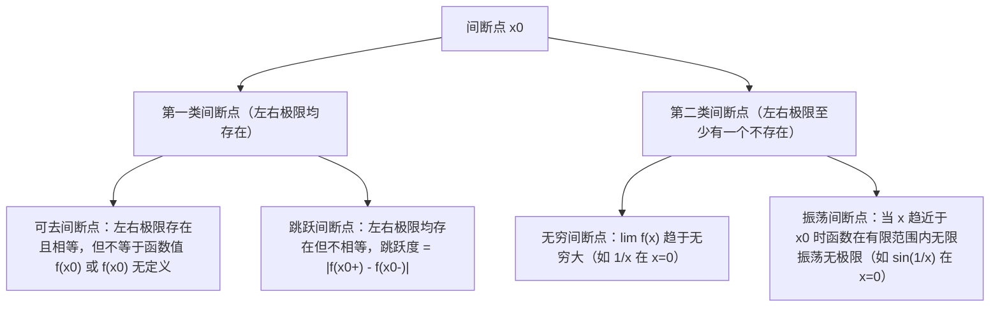

## 第01讲：函数、极限与连续性

<!-- [IMG_0587] -->
### 一、函数概念、四大特性与极限基础性质

#### 1. 函数的基本概念
* **定义**：设数集 $D \subset \mathbb{R}$，若对 $\forall x \in D$，按照对应法则 $f$，都有唯一确定的实数 $y$ 与之对应，则称 $y$ 为 $x$ 的函数，记作 $y = f(x)$。
  * $x$ 称为自变量，$D = D_f$ 称为**定义域**。
  * 集合 $R_f = \{y \mid y = f(x), x \in D\}$ 称为**值域**。
  * 函数的两大构成要素：**定义域**与**对应法则**（两者均相同才为同一函数）。
* **反函数**：
  * **存在充要条件**：映射为双射（单调函数必有反函数，严格增对应严格增，严格减对应严格减）。
  * **图象对称性**：$y = f(x)$ 与其反函数 $y = f^{-1}(x)$ 的图象关于直线 $y = x$ 轴对称。
  * **导数互逆关系**：若 $y=f(x)$ 可导且 $f'(x) \ne 0$，则 $[f^{-1}(y)]' = \frac{1}{f'(x)}$ 或 $\frac{dx}{dy} = \frac{1}{\frac{dy}{dx}}$。
* **双曲函数与反双曲函数核心族**：
  * **双曲正弦**：$\sinh x = \frac{e^x - e^{-x}}{2}$（奇函数，$\mathbb{R}$ 上严格单调递增，$(\sinh x)' = \cosh x$）
  * **双曲余弦**：$\cosh x = \frac{e^x + e^{-x}}{2}$（偶函数，悬链线，值域 $[1, +\infty)$，$(\cosh x)' = \sinh x$）
  * **双曲正切**：$\tanh x = \frac{\sinh x}{\cosh x} = \frac{e^x - e^{-x}}{e^x + e^{-x}}$（奇函数，值域 $(-1, 1)$，$(\tanh x)' = \frac{1}{\cosh^2 x} = 1 - \tanh^2 x$）
  * **核心恒等式**：$\cosh^2 x - \sinh^2 x = 1$，$1 - \tanh^2 x = \operatorname{sech}^2 x$
  * **反双曲函数对数表达**：
    * $\operatorname{arsh} x = \ln(x + \sqrt{x^2 + 1}) \quad (x \in \mathbb{R})$
    * $\operatorname{arch} x = \ln(x + \sqrt{x^2 - 1}) \quad (x \ge 1)$
    * $\operatorname{arth} x = \frac{1}{2}\ln\frac{1+x}{1-x} \quad (|x| < 1)$

#### 2. 函数的四大基本特性
1. **有界性**：
   * 设 $f(x)$ 在集合 $X$ 上有定义。若 $\exists M > 0$，使得对 $\forall x \in X$，均有 $|f(x)| \le M$，则称 $f(x)$ 在 $X$ 上有界。
   * 等价于：既有上界又有下界（$\inf_{x\in X} f(x) > -\infty$ 且 $\sup_{x\in X} f(x) < +\infty$）。
2. **单调性**：
   * 设区间 $I \subset D_f$。若对 $\forall x_1, x_2 \in I$ 且 $x_1 < x_2$，恒有 $f(x_1) < f(x_2)$，则称 $f(x)$ 在 $I$ 上严格单调递增；若 $f(x_1) > f(x_2)$，则严格单调递减。
3. **奇偶性**：
   * 定义域必须关于原点对称（这是具有奇偶性的先决条件）。
   * **奇函数**：$f(-x) = -f(x)$ $\implies$ 图象关于原点对称；若 $0 \in D_f$，则必有 $f(0) = 0$。
   * **偶函数**：$f(-x) = f(x)$ $\implies$ 图象关于 $y$ 轴对称；若可导，则必有 $f'(0) = 0$。
   * **导数与积分的奇偶互转定理**：
     * 可导奇函数的导函数为偶函数；可导偶函数的导函数为奇函数。
     * 连续奇函数的全体原函数全为偶函数（即 $\int_a^x f(t)dt$ 为偶函数，对任意常数 $a$）。
     * 连续偶函数的全体原函数中，**有且仅有一个是奇函数**（即变下限为 0 的变限积分 $F(x) = \int_0^x f(t)dt$ 是奇函数，其余原函数 $F(x)+C$ 当 $C \ne 0$ 时既非奇亦非偶）。
4. **周期性**：
   * 若存在正数 $T > 0$，使得对 $\forall x \in D_f$，恒有 $x \pm T \in D_f$ 且 $f(x+T) = f(x)$，则称 $f(x)$ 为以 $T$ 为周期的周期函数。
   * 可导周期函数的导函数仍是同周期函数。
   * **变限积分周期性条件**：连续周期函数 $f(x)$（周期为 $T$）的变限积分 $F(x) = \int_0^x f(t)dt$ 具有周期性（周期为 $T$）的**充要条件**是：其在一个周期上的定积分积分为零，即 $\int_0^T f(t)dt = 0$。

#### 3. 极限的严格定义
* **$\varepsilon-\delta$ 语言（$x \to x_0$）**：
  $$\lim_{x\to x_0} f(x) = A \iff \forall \varepsilon > 0, \exists \delta > 0, \text{当 } 0 < |x - x_0| < \delta \text{ 时，恒有 } |f(x) - A| < \varepsilon$$
* **单侧极限与充要定理**：
  * 左极限：$\lim_{x\to x_0^-} f(x) = f(x_0^-)$
  * 右极限：$\lim_{x\to x_0^+} f(x) = f(x_0^+)$
  * **极限存在充要条件**：
    $$\lim_{x\to x_0} f(x) = A \iff f(x_0^-) = f(x_0^+) = A$$
  * *必分左右极限求的三大经典结构*：
    1. 分段函数在分段点处；
    2. 含 $e^{\frac{1}{x-x_0}}$ 结构当 $x \to x_0$ 时（$x \to 0^+$ 为 $+\infty$，$x \to 0^-$ 为 $0$）；
    3. 含 $\arctan\frac{1}{x-x_0}$ 或 $\operatorname{arccot}\frac{1}{x-x_0}$ 结构当 $x \to x_0$ 时（趋于 $\pm \frac{\pi}{2}$ 或 $0/\pi$）。

#### 4. 极限的三大基本性质
1. **唯一性**：若极限 $\lim_{x\to x_0} f(x)$ 存在，则该极限值必定唯一。
2. **局部有界性**：若 $\lim_{x\to x_0} f(x) = A$，则存在 $\delta > 0$ 及常数 $M > 0$，使得对 $\forall x \in \mathring{U}(x_0, \delta)$，恒有 $|f(x)| \le M$。
3. **局部保号性（极为重要）**：
   * **脱帽法（强不等式推强不等式）**：若 $\lim_{x\to x_0} f(x) = A > 0$（或 $A < 0$），则 $\exists \delta > 0$，当 $x \in \mathring{U}(x_0, \delta)$ 时，恒有 $f(x) > 0$（或 $f(x) < 0$）。
     更精确地：对 $\forall r \in (0, A)$，$\exists \delta > 0$，使得 $f(x) > r > 0$。
   * **戴帽法（弱不等式极限仍为弱不等式）**：若在去心邻域 $\mathring{U}(x_0, \delta)$ 内恒有 $f(x) \ge 0$（或 $f(x) \le 0$），且 $\lim_{x\to x_0} f(x) = A$ 存在，则必有 $A \ge 0$（或 $A \le 0$）。
   * *避坑警示*：严格不等式在取极限后**等号可能被激活**！例如：$x > 0$ 时 $\frac{1}{x+1} > 0$，但 $\lim_{x\to +\infty}\frac{1}{x+1} = 0$。

#### 5. 无穷小量与无穷大量
* **无穷小量**：以 0 为极限的变量（$\lim f(x) = 0$）。0 是唯一可以作为无穷小量的常数。
* **无穷大量**：极限为无穷大的变量（$\lim |f(x)| = +\infty$）。注意：无穷大不是数，而是一种变化状态。
* **互为倒数关系**：在同一变化过程中，若 $f(x)$ 为无穷大，则 $\frac{1}{f(x)}$ 为无穷小；反之，若 $f(x)$ 为无穷小且 $f(x) \ne 0$，则 $\frac{1}{f(x)}$ 为无穷大。
* **基本性质**：
  * 有限个无穷小量的代数和仍为无穷小量；
  * 有界函数与无穷小量的乘积仍是无穷小量（**极其常用的放缩杀手锏**，如 $\lim_{x\to 0} x \sin\frac{1}{x} = 0$）。

---

<!-- [IMG_0588] -->
### 二、无穷小阶数比较、常用等价代换、未定式与间断点分类

#### 1. 无穷小阶数比较
设在同一极限过程中，$\alpha(x) \to 0, \beta(x) \to 0$，且 $\alpha(x) \ne 0$：
* **高阶无穷小**：若 $\lim \frac{\beta}{\alpha} = 0$，记作 $\beta = o(\alpha)$。
* **低阶无穷小**：若 $\lim \frac{\beta}{\alpha} = \infty$。
* **同阶无穷小**：若 $\lim \frac{\beta}{\alpha} = c \ne 0$。
* **等价无穷小**：若 $\lim \frac{\beta}{\alpha} = 1$，记作 $\alpha \sim \beta$。
* **$k$ 阶无穷小**：若 $\lim \frac{\beta}{\alpha^k} = c \ne 0$ ($k > 0$)，则称 $\beta$ 是关于 $\alpha$ 的 $k$ 阶无穷小。

#### 2. 常用等价无穷小代换公式大全（当 $x \to 0$ 时）
##### (1) 一阶基础等价
$$\sin x \sim x, \quad \tan x \sim x, \quad \arcsin x \sim x, \quad \arctan x \sim x$$
$$e^x - 1 \sim x, \quad \ln(1+x) \sim x, \quad (1+x)^\alpha - 1 \sim \alpha x$$
$$a^x - 1 \sim x \ln a, \quad \log_a(1+x) \sim \frac{x}{\ln a}$$

##### (2) 二阶基础等价
$$1 - \cos x \sim \frac{1}{2} x^2, \quad \cosh x - 1 \sim \frac{1}{2} x^2, \quad x - \ln(1+x) \sim \frac{1}{2} x^2$$

##### (3) 高阶差量等价（极其容易直接命题考查！）
* $\tan x - \sin x \sim \frac{1}{2} x^3$
* $x - \sin x \sim \frac{1}{6} x^3$
* $\arcsin x - x \sim \frac{1}{6} x^3$
* $\tan x - x \sim \frac{1}{3} x^3$
* $x - \arctan x \sim \frac{1}{3} x^3$
* $\arcsin x - \sin x = (\arcsin x - x) + (x - \sin x) \sim \frac{1}{6}x^3 + \frac{1}{6}x^3 = \frac{1}{3} x^3$
* $\tan x - \arcsin x \sim \frac{1}{6} x^3$

#### 3. 经典函数的增长阶梯比较（$x \to +\infty$）
$$\ln^\alpha x \ll x^\beta \ll a^x \ll x! \ll x^x \quad (\alpha > 0, \beta > 0, a > 1)$$
* **考研解题口诀**：“对数不如幂，幂不如指数，指数不如阶乘，阶乘不如幂指”。在抓大头（求 $\frac{\infty}{\infty}$ 极限）时，低阶项可直接忽略。

#### 4. 七大未定式分类及标准转化路径
| 未定式类型 | 核心处理技巧与转化方法 |
| :--- | :--- |
| $\frac{0}{0}$ | 洛必达法则、泰勒展开公式（展开至首个非零系数项）、等价无穷小代换、提公因式消零 |
| $\frac{\infty}{\infty}$ | 洛必达法则、分子分母同除以最高阶增长项（抓大头）、斯托尔兹定理（针对数列） |
| $0 \cdot \infty$ | 化商法：$u \cdot v = \frac{u}{1/v} \implies \frac{0}{0}$ 或 $\frac{v}{1/u} \implies \frac{\infty}{\infty}$（化简原则：对数、反三角优先留在分子） |
| $\infty - \infty$ | 1) 分式结构：**通分**化为 $\frac{0}{0}$；2) 根式无理结构：**有理化**；3) 变量提项：**提最高阶无穷大因子**化为 $0 \cdot \infty$ |
| $1^\infty$ | **核心基准公式法**：若 $\alpha(x) \to 0, \beta(x) \to \infty$，则 $\lim [1+\alpha(x)]^{\beta(x)} = e^{\lim \alpha(x)\beta(x)}$；或写为指数形式 $e^{\lim \beta(x)\ln(1+\alpha(x))}$ |
| $0^0$ | 对数恒等式转化：$u(x)^{v(x)} = e^{v(x) \ln u(x)}$，转化为求指数极限 $\lim v(x) \ln u(x) \, (0 \cdot (-\infty))$ |
| $\infty^0$ | 对数恒等式转化：$u(x)^{v(x)} = e^{v(x) \ln u(x)}$，转化为求指数极限 $\lim v(x) \ln u(x) \, (0 \cdot \infty)$ |

#### 5. 函数的连续性与间断点分类体系
* **连续定义**：若 $\lim_{x\to x_0} f(x) = f(x_0)$，即 $\lim_{\Delta x \to 0} \Delta y = 0$，则称 $f(x)$ 在点 $x_0$ 处连续。
  * 连续需满足三要素：1) $f(x)$ 在 $x_0$ 有定义；2) $\lim_{x\to x_0} f(x)$ 存在；3) 极限值等于函数值。
* **间断点分类（看左右极限是否存在有限值）**：

---

<!-- [IMG_0589] -->
### 三、补充专题1：初等函数深入、有界性判别与三角函数图象

#### 1. 双曲与反双曲函数全面对照
* **$\sinh x$ vs $\cosh x$**：
  * $\sinh 0 = 0, \cosh 0 = 1$。
  * 导数：$(\sinh x)' = \cosh x, (\cosh x)' = \sinh x$（无负号，注意与三角函数区分！）。
  * 积分：$\int \sinh x dx = \cosh x + C, \int \cosh x dx = \sinh x + C$。
* **反双曲函数推导解析**（以 $\operatorname{arsh} x$ 为例）：
  令 $y = \sinh x = \frac{e^x - e^{-x}}{2}$，两边同乘 $2e^x$ 得：$(e^x)^2 - 2y(e^x) - 1 = 0$。
  解此关于 $e^x$ 的一元二次方程（由于 $e^x > 0$，舍去负根）：
  $$e^x = y + \sqrt{y^2 + 1} \implies x = \ln(y + \sqrt{y^2 + 1})$$
  故 $\operatorname{arsh} x = \ln(x + \sqrt{x^2 + 1})$。同理可得 $\operatorname{arch} x = \ln(x + \sqrt{x^2 - 1}) \, (x \ge 1)$。

#### 2. 函数有界性严格判定准则与经典反例分析
* **闭区间有界性定理**：若函数 $f(x)$ 在闭区间 $[a, b]$ 上连续，则 $f(x)$ 在 $[a, b]$ 上必定有界。
* **开区间 $(a, b)$ 连续函数有界性充要条件**：
  若 $f(x)$ 在开区间 $(a, b)$ 上连续，则 $f(x)$ 在 $(a, b)$ 上有界的**充要条件**是：其在两端点的单侧极限 $\lim_{x\to a^+} f(x)$ 与 $\lim_{x\to b^-} f(x)$ **均存在且为有限值**。
  * *反例1*：$f(x) = \frac{1}{x}$ 在 $(0, 1)$ 上连续，但 $\lim_{x\to 0^+} \frac{1}{x} = +\infty$，故在 $(0, 1)$ 无界。
  * *反例2*：$f(x) = \sin\frac{1}{x}$ 在 $(0, 1)$ 上，虽然 $\lim_{x\to 0^+} \sin\frac{1}{x}$ 不存在（振荡），但由 $|\sin u| \le 1$ 可知其在 $(0, 1)$ 显然有界！说明端点极限存在是充分条件，若极限不存在但为振荡有界，函数仍可有界。
* **导数有界与原函数有界的关系辨析**：
  * **定理**：若导函数 $f'(x)$ 在区间 $I$ 上有界，即 $|f'(x)| \le M$，则由拉格朗日中值定理：
    $$|f(x_1) - f(x_2)| = |f'(\xi)| |x_1 - x_2| \le M |x_1 - x_2|$$
    故在**有限区间**上，$f(x)$ 必然有界（满足 Lipschitz 条件）。
  * **反之不成立（典型反例）**：$f(x)$ 有界，推不出 $f'(x)$ 有界！
    *反例*：$f(x) = \sin(x^2)$ 在 $\mathbb{R}$ 上显然有界（$|f(x)| \le 1$），但其导数 $f'(x) = 2x \cos(x^2)$，当 $x \to +\infty$ 时导数振荡无界！
    *有限区间反例*：$f(x) = \sqrt{x}$ 在 $(0, 1)$ 上有界（值域 $(0, 1)$），但 $f'(x) = \frac{1}{2\sqrt{x}} \to +\infty$（$x \to 0^+$），导函数无界。

#### 3. 三角函数 $\sin, \cos, \tan, \cot$ 图像与核心性质
* $\sin x, \cos x$：定义域 $\mathbb{R}$，值域 $[-1, 1]$，最小正周期 $2\pi$。
* $\tan x$：定义域 $x \ne k\pi + \frac{\pi}{2}$，值域 $\mathbb{R}$，最小正周期 $\pi$，在每个开区间 $(k\pi-\frac{\pi}{2}, k\pi+\frac{\pi}{2})$ 严格单增，铅直渐近线为 $x = k\pi + \frac{\pi}{2}$。
* $\cot x = \frac{1}{\tan x}$：定义域 $x \ne k\pi$，值域 $\mathbb{R}$，最小正周期 $\pi$，在开区间 $(k\pi, (k+1)\pi)$ 严格单减，铅直渐近线为 $x = k\pi$。

---

<!-- [IMG_0590] -->
### 四、补充专题2：正割、余割与反三角函数体系

#### 1. 正割函数 $\sec x$ 与余割函数 $\csc x$
* **定义**：
  $$\sec x = \frac{1}{\cos x}, \quad \csc x = \frac{1}{\sin x}$$
* **定义域与值域**：
  * $\sec x$：定义域 $x \ne k\pi + \frac{\pi}{2}$，值域 $(-\infty, -1] \cup [1, +\infty)$，偶函数，周期 $2\pi$。
  * $\csc x$：定义域 $x \ne k\pi$，值域 $(-\infty, -1] \cup [1, +\infty)$，奇函数，周期 $2\pi$。
* **基本导数与积分**：
  * $(\sec x)' = \sec x \tan x, \quad (\csc x)' = -\csc x \cot x$
  * $\int \sec x dx = \ln|\sec x + \tan x| + C = \ln|\tan(\frac{x}{2} + \frac{\pi}{4})| + C$
  * $\int \csc x dx = \ln|\csc x - \cot x| + C = \ln|\tan\frac{x}{2}| + C$
* **基本平方恒等式族**：
  $$1 + \tan^2 x = \sec^2 x, \quad 1 + \cot^2 x = \csc^2 x$$

#### 2. 六大反三角函数主值区间与互补恒等式
| 函数 | 符号 | 定义域 | 主值区间（值域） | 单调性 | 奇偶性 |
| :--- | :--- | :--- | :--- | :--- | :--- |
| 反正弦 | $\arcsin x$ | $[-1, 1]$ | $[-\frac{\pi}{2}, \frac{\pi}{2}]$ | 严格单调递增 | 奇函数：$\arcsin(-x) = -\arcsin x$ |
| 反余弦 | $\arccos x$ | $[-1, 1]$ | $[0, \pi]$ | 严格单调递减 | 非奇非偶：$\arccos(-x) = \pi - \arccos x$ |
| 反正切 | $\arctan x$ | $\mathbb{R}$ | $(-\frac{\pi}{2}, \frac{\pi}{2})$ | 严格单调递增 | 奇函数：$\arctan(-x) = -\arctan x$ |
| 反余切 | $\operatorname{arccot} x$ | $\mathbb{R}$ | $(0, \pi)$ | 严格单调递减 | 非奇非偶：$\operatorname{arccot}(-x) = \pi - \operatorname{arccot} x$ |

* **互补恒等式（极其重要）**：
  $$\arcsin x + \arccos x = \frac{\pi}{2} \quad (x \in [-1, 1])$$
  $$\arctan x + \operatorname{arccot} x = \frac{\pi}{2} \quad (x \in \mathbb{R})$$
* **倒数关系恒等式**：
  $$\arctan x + \arctan\frac{1}{x} = \begin{cases} \frac{\pi}{2}, & x > 0 \\ -\frac{\pi}{2}, & x < 0 \end{cases}$$

---

<!-- [IMG_0591] -->
### 五、补充专题3：极限运算法则要害、渐近线系统与重要工具

#### 1. 极限四则运算法则的前提条件与拆分合法性
* **基本法则**：若 $\lim f(x) = A, \lim g(x) = B$ 均**独立存在且为有限实数**，则：
  $$\lim [f(x) \pm g(x)] = A \pm B, \quad \lim [f(x) \cdot g(x)] = A \cdot B, \quad \lim \frac{f(x)}{g(x)} = \frac{A}{B} \, (B \ne 0)$$
* **拆分合法性的考研红线**：
  1. **必须保证拆分后的每一个子极限各自独立存在**。若随意拆开出现 $\infty - \infty$ 或 $0 \cdot \infty$，属于严重逻辑错误！
  2. **非零因子先求出**：若乘积项中某一因式的极限存在且**不为 0**，可以将其极限值先求出来提至极限符号外，即：
     $$\lim [f(x) \cdot g(x)] = \lim f(x) \cdot \lim g(x) = A \cdot \lim g(x) \quad (\text{只要 } A \ne 0 \text{ 且有限})$$
  3. **加减法中的等价代换前提**：在做加减法时，若 $\alpha \sim \alpha', \beta \sim \beta'$，原则上不能直接替换；但若 $\lim \frac{\alpha}{\beta} \ne 1$（即两者相减不抵消主部），可采用泰勒展开展开至同阶差量！

#### 2. 两个重要极限公式及其推广
1. **第一重要极限**：
   $$\lim_{x\to 0} \frac{\sin x}{x} = 1 \iff \sin \square \sim \square \quad (\square \to 0)$$
2. **第二重要极限**：
   $$\lim_{x\to \infty} \left(1 + \frac{1}{x}\right)^x = e \quad \text{或} \quad \lim_{x\to 0} (1 + x)^{\frac{1}{x}} = e$$
   推广形态：$(1 + \square)^{\frac{1}{\square}} \to e \quad (\square \to 0)$。

#### 3. 曲线渐近线的完整判定法则
* **水平渐近线**：
  若 $\lim_{x\to +\infty} f(x) = b$ 或 $\lim_{x\to -\infty} f(x) = b$，则直线 $y = b$ 是曲线的一条水平渐近线。
  *注*：一侧最多一条水平渐近线，双侧至多两条（如 $\arctan x$ 有 $y = \pm \frac{\pi}{2}$）。
* **铅直渐近线**：
  若 $\lim_{x\to x_0^+} f(x) = \infty$ 或 $\lim_{x\to x_0^-} f(x) = \infty$，则直线 $x = x_0$ 是曲线的一条铅直渐近线（寻找函数的无定义点或分母为 0 点）。
* **斜渐近线**：$y = ax + b$
  * 先判定斜率：$a = \lim_{x\to \pm\infty} \frac{f(x)}{x}$（$a \ne 0$ 且为有限常数；若 $a = 0$ 则退化为水平渐近线）。
  * 再判定截距：$b = \lim_{x\to \pm\infty} [f(x) - ax]$（$b$ 必须存在且为有限常数）。
  * 若 $a$ 或 $b$ 不存在，则不存在斜渐近线。
  * **注意**：同一侧（$+\infty$ 或 $-\infty$）水平渐近线与斜渐近线**互斥**，若已存在水平渐近线，则该侧无需再求斜渐近线。

#### 4. 变限积分等价代换定理（高频秒杀技巧）
* **定理**：设 $f(x)$ 连续，当 $x \to 0$ 时，$f(x) \sim a x^m$ ($m > -1$)，则：
  $$\int_0^x f(t) dt \sim \frac{a}{m+1} x^{m+1} \quad (x \to 0)$$
  *特例*：
  * $\int_0^x \sin t \, dt \sim \int_0^x t \, dt = \frac{1}{2} x^2$
  * $\int_0^x \ln(1+t) \, dt \sim \frac{1}{2} x^2$
  * $\int_0^x (e^t - 1) \, dt \sim \frac{1}{2} x^2$
  * $\int_0^x (1 - \cos t) \, dt \sim \int_0^x \frac{1}{2}t^2 \, dt = \frac{1}{6} x^3$

#### 5. 拉格朗日中值同构变形在极限中的应用
当出现形如 $f(b) - f(a)$ 结构且 $b - a \to 0$ 时，运用拉格朗日中值公式：
$$f(b) - f(a) = f'(\xi)(b - a) \quad (\xi \text{ 介于 } a, b \text{ 之间})$$
由夹逼准则，当 $a, b \to x_0$ 时，$\xi \to x_0$，故可快速代换求极限。例如：
$\lim_{x\to 0} \frac{\sin(\sin x) - \sin x}{x^3}$，令 $f(t) = \sin t$，则 $\sin(\sin x) - \sin x = \cos\xi (\sin x - x)$，其中 $\xi \to 0 \implies \cos\xi \to 1$，原式 $= \lim_{x\to 0} \frac{1 \cdot (-\frac{1}{6}x^3)}{x^3} = -\frac{1}{6}$。

---

<!-- [IMG_0592] -->
### 六、补充专题4：变限积分函数性态分析与奇偶性定理

#### 1. 变限积分函数的奇偶性严格定理
设函数 $f(x)$ 在区间 $[-X, X]$ 上连续，考察变限积分函数：
$$\Phi(x) = \int_a^x f(t) \, dt$$
1. **被积函数 $f(x)$ 为奇函数时**：
   * 对任意选定的下限常数 $a \in [-X, X]$，函数 $\Phi(x)$ **必为偶函数**！
   * *严谨证明*：
     $$\Phi(-x) = \int_a^{-x} f(t) dt \xlongequal{t = -u} \int_{-a}^x f(-u)(-du) = \int_{-a}^x f(u)du$$
     由 $f(u)$ 是奇函数知 $\int_{-a}^a f(u)du = 0$，故：
     $$\int_{-a}^x f(u)du = \int_{-a}^a f(u)du + \int_a^x f(u)du = 0 + \int_a^x f(u)du = \Phi(x)$$
     因此 $\Phi(-x) = \Phi(x)$ 恒成立，即 $\Phi(x)$ 必为偶函数。
2. **被积函数 $f(x)$ 为偶函数时**：
   * 变限积分函数 $\Phi(x) = \int_a^x f(t) \, dt$ 为奇函数的**充要条件**是：下限常数 $a$ 满足 $\int_0^a f(t) \, dt = 0$。
   * 特别地，当下限取 $a = 0$ 时，$\Phi(x) = \int_0^x f(t) \, dt$ **必为奇函数**；若 $a \ne 0$ 且 $\int_0^a f(t)dt \ne 0$，则 $\Phi(x)$ 既非奇亦非偶。

#### 2. 变限积分函数的零点、极值与单调性分析
* **求导核心公式**：$\frac{d}{dx}\int_a^x f(t) dt = f(x)$。
* **单调区间**：直接由被积函数 $f(x)$ 的正负号决定（$f(x) > 0 \implies \Phi(x)$ 单增；$f(x) < 0 \implies \Phi(x)$ 单减）。
* **极值点**：$f(x)$ 穿透横轴变号的零点即为 $\Phi(x)$ 的极值点（若 $f(x)$ 从正变负则为极大值，从负变正则为极小值）。
* **零点分布**：$\Phi(a) = \int_a^a f(t)dt = 0$（天然保证 $x = a$ 是一个零点），结合单调性分析可精确锁定零点个数。

---

